# Introducing Disaster Recovery for IBM MQ Replicated Data Queue Manager

## RDQM DR Background

You can create a primary instance of a disaster recovery queue manager running on one server, and a secondary instance of the queue manager on another server that acts as the recovery node. Data is replicated between the queue manager instances. If you lose your primary queue manager, you can manually make the secondary instance into the primary instance and start the queue manager, then resume work from the same place. You cannot start a queue manager while it is in the secondary role. The replication of the data between the two nodes is handled by DRBD.

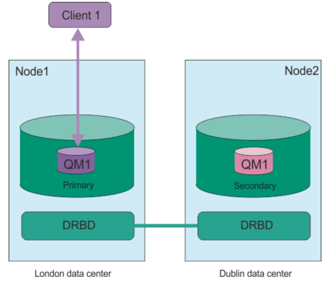

You can choose between synchronous and asynchronous replication of data between primary and secondary queue managers. If you select the asynchronous option, operations such as IBM® MQ PUT or GET complete and return to the application before the event is replicated to the secondary queue manager. Asynchronous replication means that, following a recovery situation, some messaging data might be lost. But the secondary queue manager will be in a consistent state, and able to start running immediately, even if it is started at a slightly earlier part of the message stream.

You cannot add disaster recovery to an existing queue manager, and a queue manager cannot be configured with both RDQM disaster recovery and RDQM high availability.

You can have several pairs of RDQM queue managers running on a number of different servers. For example, you could have six primary DR queue managers running on the same node, while their secondaries are configured on six different nodes in six different data centers. 


Equally you could have primary disaster recovery queue managers running on different nodes, while all their secondary disaster recovery queue manages run on the same node. Some example configurations are illustrated in the following diagrams.

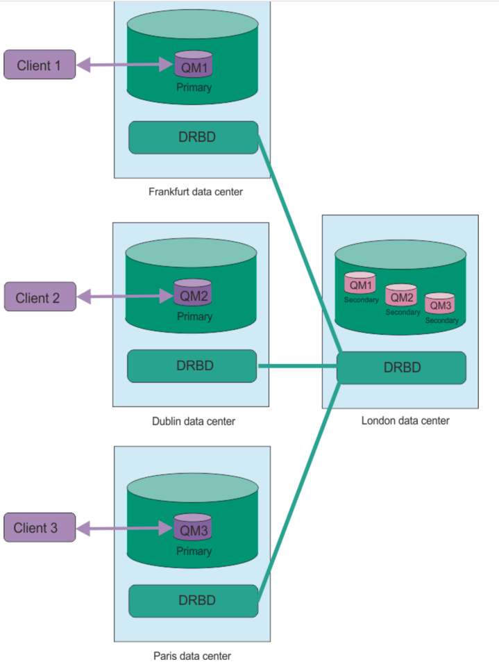

### Replication, synchronization, and snapshots

While the two nodes in a disaster recovery configuration are connected, any updates to the persistent data for a disaster recovery queue manager are transferred from the primary instance of the queue manager to the secondary instance. This is known as *replication*.

If the network connection between the two nodes is lost, the changes to the persistent data for the primary instance of a queue manager are tracked. When the network connection is restored, a different process is used to get the secondary instance up to speed as quickly as possible. This is known as *synchronization*.

While synchronization is in progress, the data on the secondary instance is in an inconsistent state. A *snapshot* of the state of the secondary queue manager data is taken. If a failure of the main node or the network connection occurs during synchronization, the secondary instance reverts to this snapshot and the queue manager can be started. Any of the updates that happened since the original network failure are lost, however. 


## RDQM DR Lab Introduction

This lab provides a demonstration of a new approach to Disaster Recovery in MQ on Linux, with the following key features:

* Use of Distributed Replicated Block Device (DRBD) storage rather than network shared storage
* This is still using a Replicated Data Queue Manager (RDQM):
	* Takeover will be manual, not automatic
	* Both asynchronous and synchronous replication is supported
	* An RDQM is active on only one node at any one time
	* Each node can run different active RDQMs
	* An individual DR RDQM is created to use one style of replication and it cannot be changed without recreating the RDQM
	* As only two nodes are involved, it will be possible to get into a split-brain situation; but only if a user has chosen to promote a DR Secondary and start a DR RDQM when the DR network is disconnected and the DR RDQM is still running, or is also started where it was Primary.

The goals for RDQM-DR are:

* Allow an RDQM to be created which is configured to replicate its data to a single Secondary instance at a given IP address

	* Asynchronous replication is supported provided the latency is no more than 50ms for a round trip time
	
	* Synchronous replication is subject to the same 5ms limits on latency as it is for HA


* Allow manual control of when a DR Secondary becomes a DR Primary and can then run the RDQM

In this lab, instructions are provided to show the setup for both.

### Lab environment

1. Two RHEL 7.7 x86_64 systems and one Windows desktop running in IBM TechZone: 

	* dr1  	- This will be our primary node
	* dr2  	- This will be a secondary node
	* mq-pot 	- Windows desktop for connecting to the two RHEL machines

	Note: There are four  additional VMs in the IBM TechZone template which are not used; dr3, rdqm1, rdqm2, and rdqm3 can be ignored.
	
1. Network interfaces:

	|Interface Purpose | Interface Name |  dr1 (Primary node)  | dr2 (Secondary node) | 
	|:------:|:--------:|:--------:|:-----:|:--------|
	| Administration | ens34 | 10.0.0.1 |10.0.0.2 |
	| DR Replication | ens36 | 10.0.2.1 |10.0.2.2 |
	| MQ Fixed IP | ens35  | 10.0.1.1 |10.0.1.2 |
	| MQ Floating IP | |10.0.1.10 | 10.0.1.10 | |

	DR Replication - for synchronous / asynchronous data replication (the higher the bandwidth the better and the lower the latency the better)

### Pre-configuration steps 

The following steps are necessary for configuring RDQM, and are shown for your reference. They have **already been completed** on the VMs. 

* Although not required for this Lab, the following Pacemaker dependencies required for RDQM HA have already been installed. This list should be sufficient for a standard installation of RHEL 7.7 Server or Workstation. For your own environment setup, if you are using some other installation, then additional packages may be needed:

	* cifs-utils
	* libcgroup
	* libtool-ltdl
	* lm_sensors-libs
	* lvm2
	* net-snmp-agent-libs
	* net-snmp-libs
	* nfs-utils
	* perl-TimeDate
	* psmisc
	* redhat-lsb-core

* Extract and Install MQ 

	The code is provided as a compressed tar file in the directory /home/student/Downloads.
	
* Install the MQ and RDQM code 

	RDQM is a single feature which now supports HA and/or DR (but not at the same time for a single queue manager). The RDQM support requires the Server and Runtime packages. 
	Run the installation script.		

* Configure the RedHat firewall 

	If there is a firewall between the nodes in the HA group, then the firewall must allow traffic between the nodes on a range of ports. 
	
	Firewall (firewalld) enabled, and ports 1500 & 1501 will be defined during the lab.
	
* Configure the OS storage settings 

	If the system uses SELinux in a mode other than permissive, you must run the following command:

	   ```
	    semanage permissive -a drbd_t
	   ``` 
	
* Configure groups 

	To create, delete, or configure replicated data queue managers (RDQMs) you must use a user ID that belongs to both the mqm and haclient groups. 
	
	If want to allow a normal user in the mqm group to create RDQM instances etc., you need to grant the user access to the certain commands via sudo. The user will also need to be part of the mqm group. 
	
	You will add the mqm user to the root and haclient group. Then add root, and ibmuser to the mqm and haclient groups. 
	
	 The following groups set up: 

	* **mqm** to allow user to run specific MQ commands, 

	* A normal user "ibmuser" has been defined for running applications and MQ commands.

	|Name   | Password |  Purpose | Group |
|:-----:|:--------:|:--------:|:-----:|
|root | IBMDem0s! | superuser |  |
|ibmuser | engageibm | host vm user - mq user | mqm     |

  	
* Create the Logical Group for the QM data 

	Each node requires a volume group named drbdpool. The storage for each replicated data queue manager is allocated as a separate logical volume per queue manager from this volume group. For the best performance, this volume group should be made up of one or more physical volumes that correspond to internal disk drives (preferably SSDs). 

The above steps have already been completed on each node so at this point you are ready to begin RDQM configuration. 


### Setup the environment (pre-configured on TechZone):

In the TechZone environment, there are seven virtual machines: rdqm1, rdqm2, rdqm3, dr1, dr2, dr3, and mq-pot which currently should be in a powered on state. This template is used for multiple labs and has been configured with the maximum number of VMs that are required for all labs. dr3, rdqm1, rdqm2, and rdqm3 will not be used in this lab. You will only need dr1, dr2, and mq-pot. The rest of the VMs can be ignored. 

1. Click the *VM Remote Console* button for **mq-pot**.

	 

1. When the desktop appears, click the *Open in a new window* button. 

	
	
1.	A new browser tab is opened. Click the desktop, enter *passw0rd* for ibmdemo's password and hit enter.

	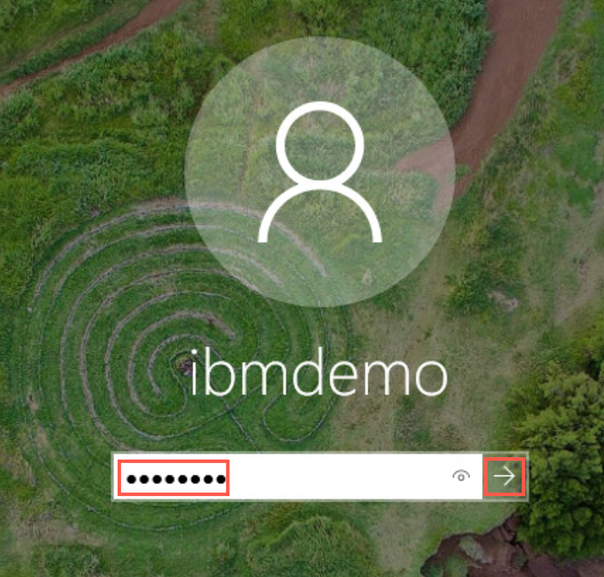	
1. You will use *putty* to connect to each of the RHEL VMs. Double click the *putty* icon on the desktop.

	

1. The IP address for *dr1* is **10.0.0.14**. Enter that address in the *Host Name* field and click *Open*. 

	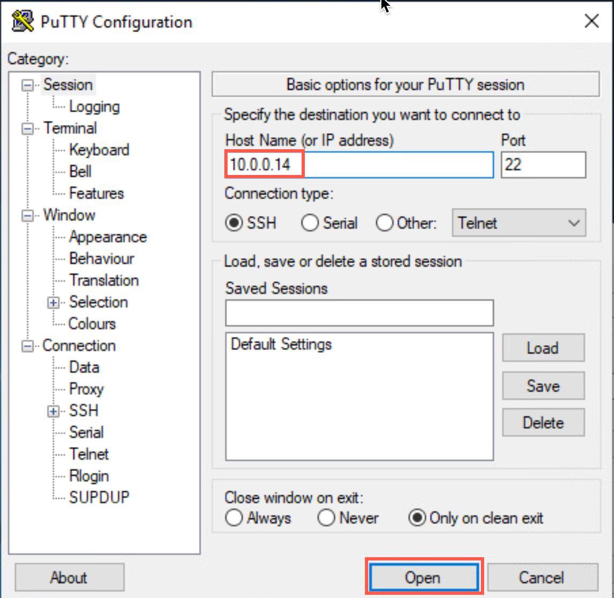

1. A new terminal window appears:

	
	
1. Log on to the VM as user **ibmuser**, using password **engageibm**. 

	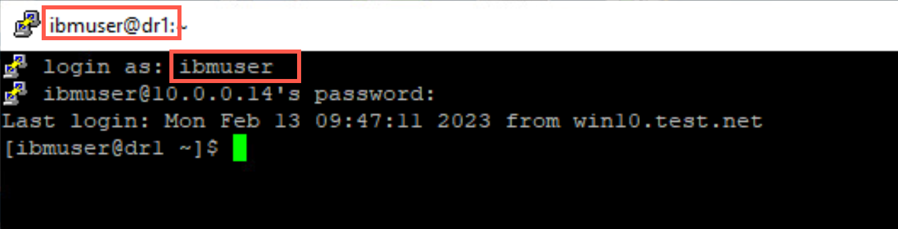
	
1. Open new *putty* window **dr2** using 10.0.0.15. 

	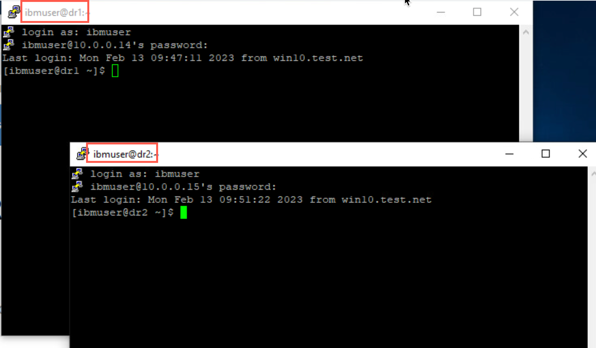

1. You will use the putty terminal windows for interactions with the RHEL VMs. When instructed to open a additional terminals for a VM, just open another *putty* window for that VM.

## Configure RDQM-DR

A primary instance of a disaster recovery queue manager is created on one server. A secondary instance of the same queue manager must be created on another server, which acts as the recovery node. Data is replicated between the queue manager instances. The replication of the data between the two nodes is handled by DRBD.

Unlike the High Availability solution, there is no heartbeat detection between the two nodes. If the primary queue manager node is lost, the secondary instance can be manually made into the primary instance, the queue manager started, and work resumed.

Data replication between primary and secondary queue managers can be done synchronously or asynchronously. If the asynchronous option is selected, operations such as PUT or GET complete and return to the application before the data is replicated to the secondary queue manager. Asynchronous replication means that, following a recovery situation, some messaging data might be lost. But the secondary queue manager will be in a consistent state, and able to start running immediately, even if it is started at a slightly earlier part of the message stream.

You will configure a DR RDQM that uses asynchronous replication.

### Create the DR RDQM

You will create a DR RDQM with asynchronous replication. You must first create a primary RDQM DR queue manager. Then you will create a secondary instance of the same queue manager on another node. The primary and secondary instances must have the same name and be allocated the same amount of storage.	
#### Update firewall rules	

1. On each of the nodes, open the firewall port defined (1502) for the queue manager.

	```
	sudo firewall-cmd --add-port=1502/tcp
	```
	
	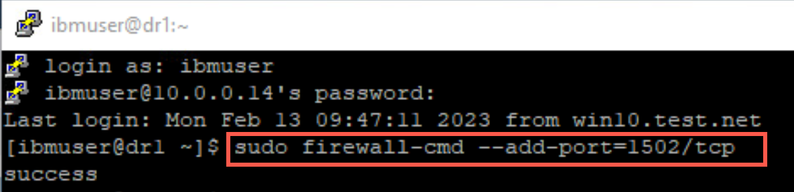
	
1. To verify the ports are now open, enter the following command: 

	```
	sudo firewall-cmd --list-ports
	```

	Results should look like this:
	
	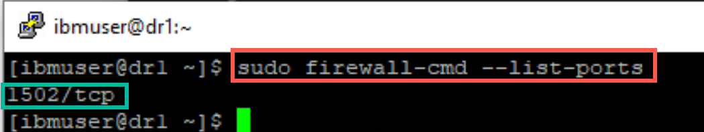
	
1. Don't forget, each node must have this port opened in the firewall.
	
1. Start firewall by entering the following command.

	```
	sudo systemctl start firewalld
	```
	
	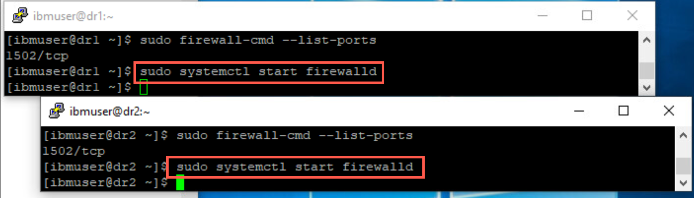
	
1. Return to **dr1** and repeat the previous step to start the firewall there also. 

#### Create queue manager	

1.	Create a primary queue manager on node **dr1**. It will use asynchronous replication. The local IP for DR replication is 10.0.2.14. The recovery IP used for replication on the secondary instance is 10.0.2.15. Replication will take place using port 7001. The queue manager listener port will be 1502. The queue manager will be QMDR. 

	In the terminal window, create the primary node: 

	```
	sudo crtmqm -rr p -rt a -rl 10.0.2.14 -ri 10.0.2.15 -rn dr2 -rp 7001 -p 1502 QMDR
	```
	
	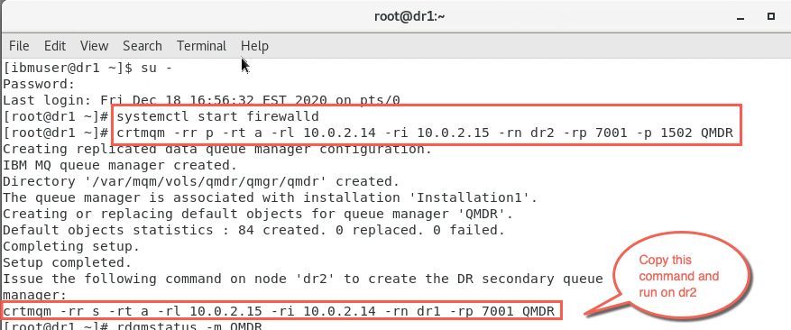
	
	Notice at the end, the command needed to create the secondary instance is provided for you.
	
1. Switch to the **dr2** terminal and create a secondary instance of the queue manager on node **dr2** with the following command: 
 
	```
	sudo crtmqm -rr s -rt a -rl 10.0.2.15 -ri 10.0.2.14 -rn dr1 -rp 7001 QMDR
	```

	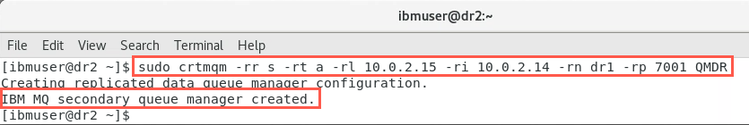
	
	This is the command which was provided for you when you ran the crtmqm command on dr1. Normally you would copy the command from *dr1* and paste it into the terminal window on *dr2*. 
	
1. Check the status on both nodes with the command to ensure they are correct. Use the following command on both nodes. You should be using the terminal where you are logged in as root so you can drop the sudo. 
	
	```
	rdqmstatus -m QMDR
	```

	On **dr2**: 
	
	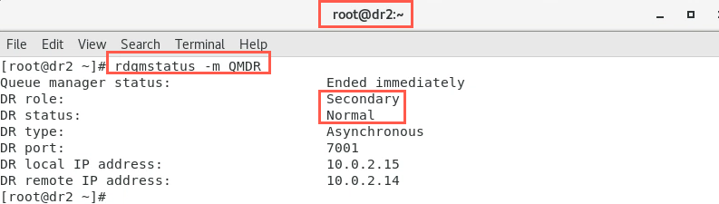 
	
	On **dr1**:
	
	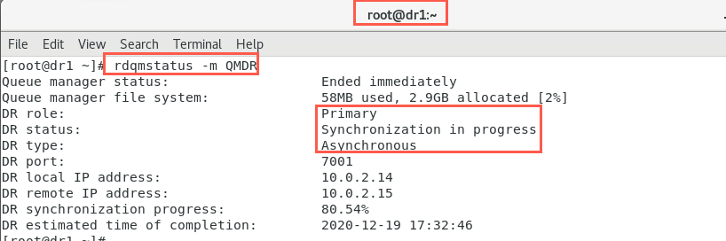

1. Issue the command again until it shows synchronization is complete. When initial synchronization has completed, it should look similar to the following:

	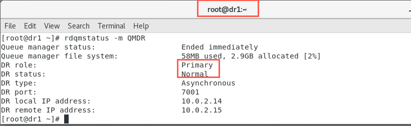

1. On the node with the secondary instance, the output should initially look similar to the following:

	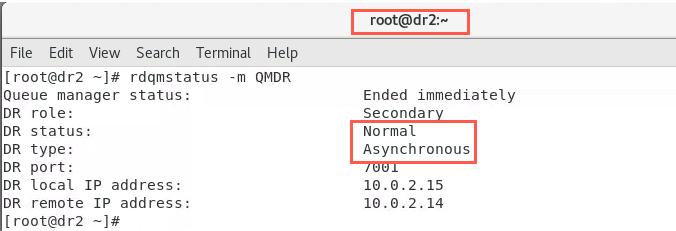
	
1. On node **dr2** open a new terminal window as the ibmuser user to be used to enter the RDQM commands. 	

1. On node **dr1** open a new terminal window as the ibmuser user and then start the queue manager with the following command:

	```
	strmqm QMDR
	```
	
	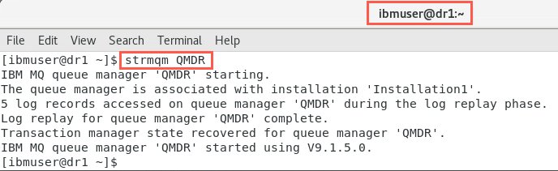


1. Now check the status on both nodes to ensure they are correct, using the command:
	
	```
	sudo rdqmstatus -m QMDR
	```

	On **dr1**, the output will initially look similar to the following:
	
	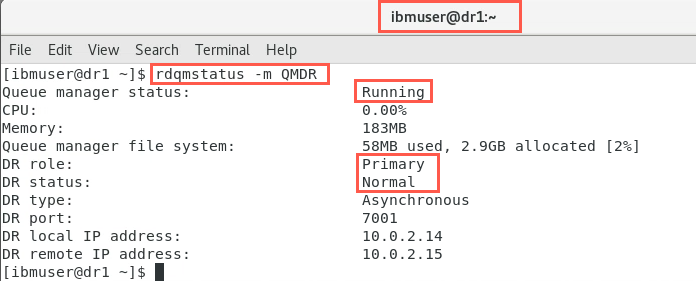
	
	As the node with the secondary instance only runs the queue manager when DR is needed, the output will be unchanged and look as it did previously.
	
	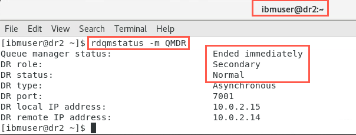
	
## Test the DR Secondary
Now that the DR nodes have been set up, you will test the secondary DR queue manager.

### Make the Primary instance the Secondary node

Only one node can be the Primary. Therefore, before another node can be designated the Primary, the original Primary needs to be designated the Secondary.

1. On node **dr1**, in ibmuser's terminal, stop the queue manager:

	```
	endmqm QMDR
	```
	
1. On node **dr1** designate node **dr1**, as the secondary using the rdqmdr command:
	
	```
	sudo rdqmdr -m QMDR -s
	```
	
	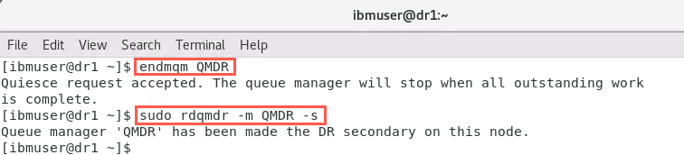
		
### Make the Secondary node the Primary instance

Designate the Secondary node as the Primary instance. 

1. On the recovery node **dr2**, designate it as the primary instance using the rdqmdr command:
	
	```
	sudo rdqmdr -m QMDR -p
	```

1. Still on **dr2** start the queue manager:

	```
	strmqm QMDR
	```
	
	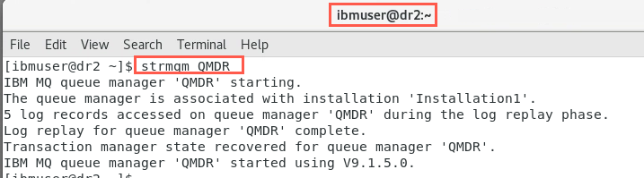	
1. Confirm the status of both nodes:
	
	```
	sudo rdqmstatus -m QMDR
	``` 
	
	On node **dr2**: 
	
	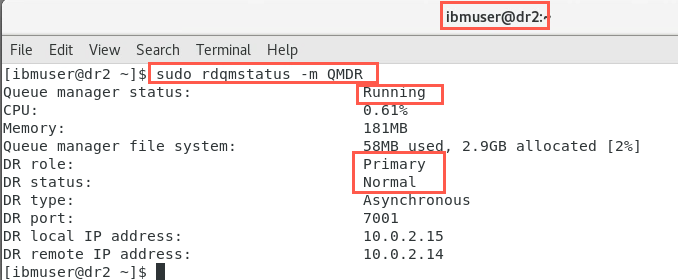
	
	On node **dr1**:
	
	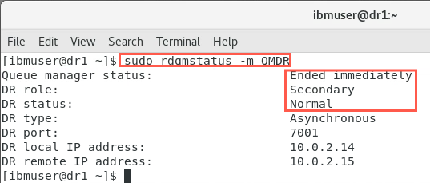
	
	Provided that channels were defined with a list of alternative connection names specifying the primary and secondary queue managers, then applications will automatically connect to the new primary queue manager.
	
### Make the Primary instance the Primary again

If the loss of the primary node was only temporary, you would want to designate it as the *Primary* instance again. This would be achieved as described below.

1. On node **dr2** stop the queue manager:
	
	```
	endmqm QMDR
	```
	
1. With root access designate node **dr2** as the *Secondary* instance:
	
	```
	sudo rdqmdr -m QMDR -s
	```
	
	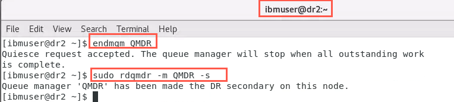
		

1. On the primary node **dr1**, with root access, designate it as the *Primary* instance again:
	
	```
	sudo rdqmdr -m QMDR -p
	```
	
1. On the primary node **dr1** restart the queue manager:
	
	```
	strmqm QMDR
	```
	
	
	
1. Confirm the status of both nodes:
	
	```
	sudo rdqmstatus -m QMDR
	```
	
	On **dr1**:
	
	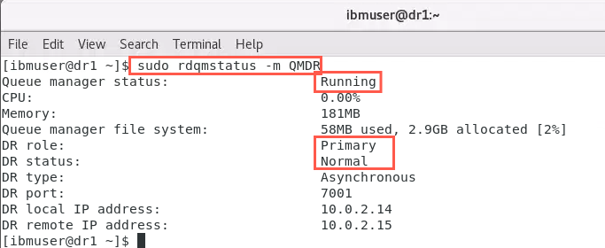
	
	On **dr2**:
	
	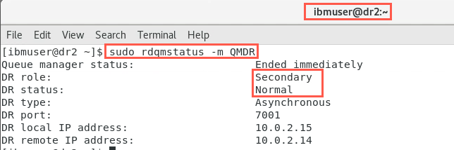
	
## Replace node that was running as DR Primary

Suppose the loss of the primary node was due to a failure, which resulted in the node having to be replaced. You would want to replace the primary node while the queue manager runs on the secondary node. Then restore the original disaster recovery configuration.

### Simulate the loss of the Primary node

Although the node has not been lost, you will simulate it by disabling the DR Replication Network adapter and deleting the queue manager. 

1. On node **dr1**, display the status of the ethernet adapters with the following command: 

	```
	nmcli device status
	```

	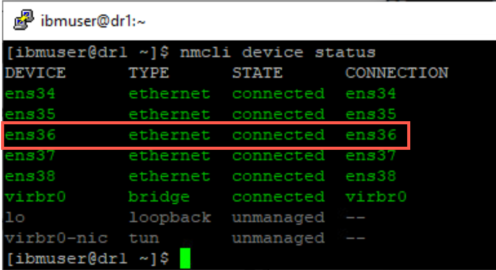

1. **ens36** network adapter is the DR Replication adapter (IP address 10.0.2.14). Turn off the network adapter with the following command:

	```
	sudo nmcli con down ens36
	```
	
	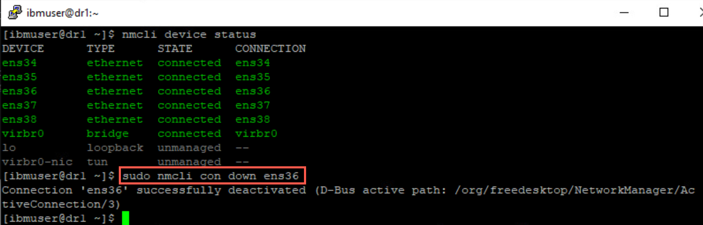
	
1. Verify that the adapter has stopped with following command:

	```
	nmcli device status
	```
	
	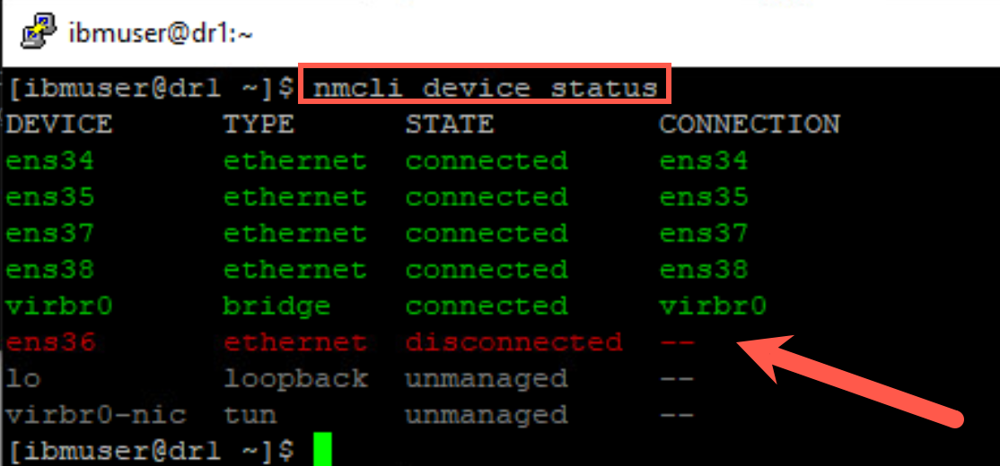
	
1. On node **dr1**, stop the queue manager:
	
	```
	endmqm QMDR
	```
	
1. With root access remove the queue manager:
	
	```
	sudo dltmqm QMDR
	```
	
	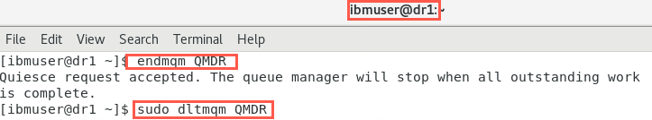
	
### Make the Secondary node the Primary instance

Designate the Secondary node as the Primary instance. 

1. On the recovery node **dr2** with root access designate it as the primary instance:
	
	```
	sudo rdqmdr -m QMDR -p
	``` 
	
1. Start the queue manager:
	
	```
	strmqm QMDR
	```
	
	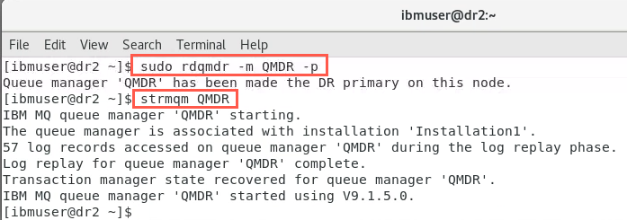
	
1. Confirm the status of both nodes: 

	```
	sudo rdqmstatus -m QMDR
	```
	
	On **dr2**:
	
	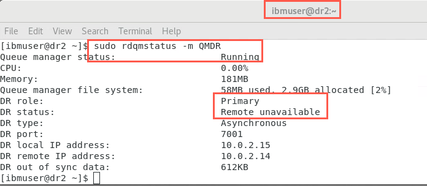
	
	As there is no longer a queue manager defined on node **dr1**, the output should look similar to the following:
	
	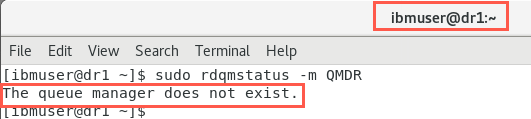
	
### Add the new Primary node into the DR configuration

For the replacement node to be brought back into the DR configuration, it must assume the identity of the failed node -- the name and IP address must therefore be the same. 

1. Remember, *rdqmdr* commands require root authority. You will determine the command that needs to be run on the new Primary node. On node **dr2**, run the command:

	
	```
	sudo rdqmdr -m QMDR -d
	```
	
	The output should look similar to the following: 
	
	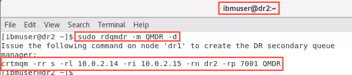
	
1. Restart the DR Replication network interface **ens36** on **dr1** with the following command:

	```
	sudo nmcli con up ens36
	```   
	
	Display the adapters to verify it reconnects with following command:
	
	```
	nmcli device status
	```
 
	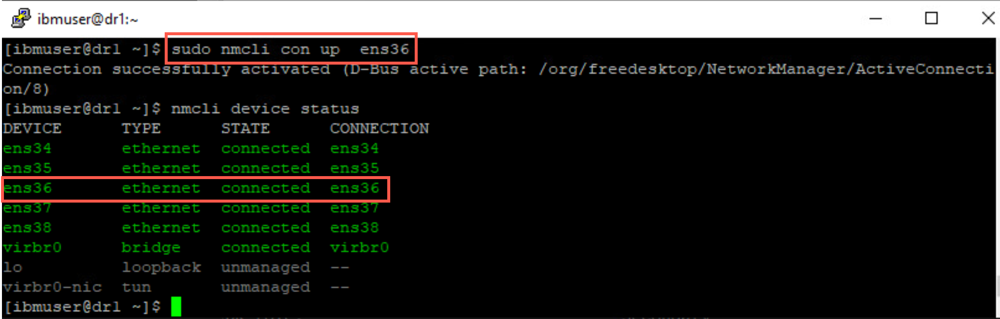

1. Copy the command (as highlighted above) into the command line of the new Primary node, **dr1**, to run it:
	
	```
	crtmqm -rr s -rl 10.0.2.14 -ri 10.0.2.15 -rn dr2 -rp 7001 QMDR
	```
	
	The output should look similar to the following:
	
	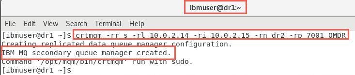
	
1. Check the status of the synchronization on both nodes:
	
	```
	sudo rdqmstatus -m QMDR
	```
	
	On **dr1**:
	
	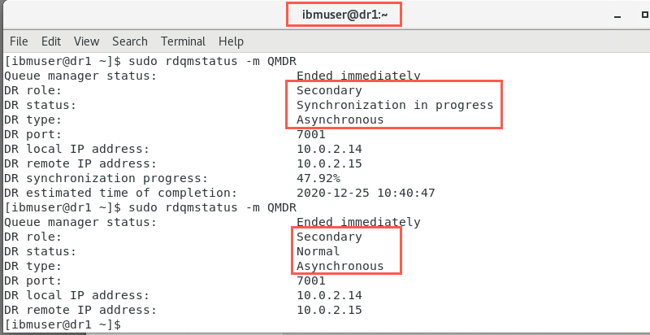
	
	On **dr2**:
	
	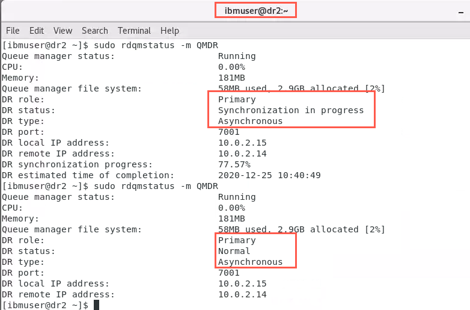
	
	Wait for synchronization to complete - *DR status = Normal* before continuing.

### Restore the original DR configuration

To restore the original DR configuration, you would want to designate the Primary node as the Primary instance again.

1. When the initial synchronization is complete on the primary node **dr1**, you can designate the secondary node as the secondary instance again. End the queue manager on node **dr2**:
	
	```
	endmqm QMDR
	```
	
1. Designate node **dr2** as the secondary instance again:
	
	```
	sudo rdqmdr -m QMDR -s
	```
	
	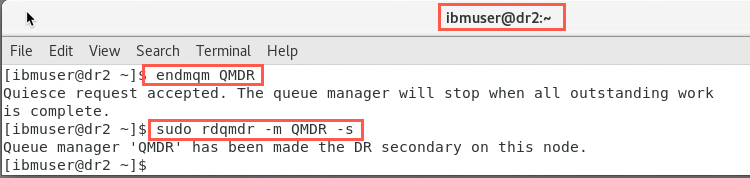
	
1. On node **dr1**, designate it as the Primary instance again:
	
	```
	sudo rdqmdr -m QMDR -p
	```
	
1. Start the queue manager on the primary node:
	
	```
	strmqm QMDR
	```	
	
	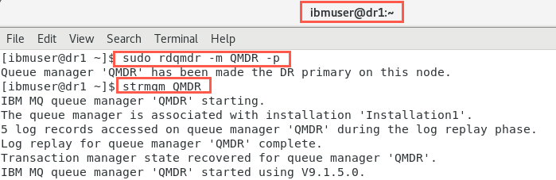
		
1. Confirm the status of both nodes:
	
	```
	sudo rdqmstatus -m QMDR
	```
	
	On **dr1**:
	
	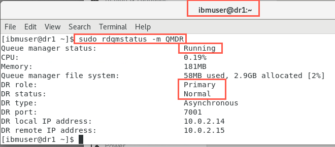
	
	On **dr2**:
	
	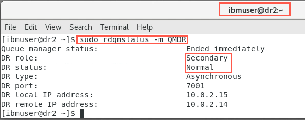

	
## Replace node that was running a DR Secondary instance

If it is a secondary node that needs to be replaced, you would just replace it and restore it to the original disaster recovery configuration.

### Add the new Secondary node into the DR configuration

To simulate this, there is no need to change the DR designations prior to the Secondary node being replaced. You will simply disable the DR Replication Network adapter.

For the replacement node to be brought back into the DR configuration, again it must assume the identity of the failed node -- the name and IP address must be the same.

1. On node **dr2**, display the status of the ethernet adapters with the following command: 

	```
	nmcli device status
	```

	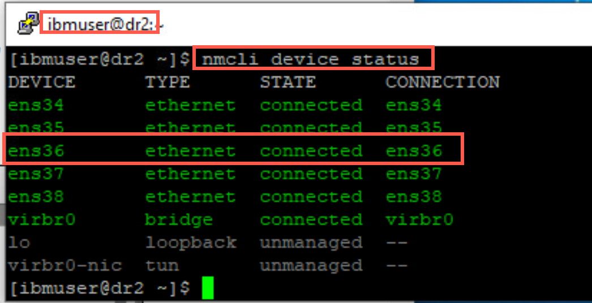

1. **ens36** network adapter is the DR Replication adapter (IP address 10.0.2.14). Turn off the network adapter with the following command:

	```
	sudo nmcli con down ens36
	```
	
1. Verify that the adapter has stopped with following command:

	```
	nmcli device status
	```
	
	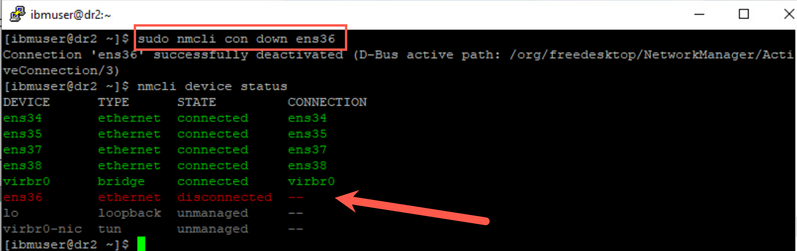

1. Still on **dr2** with root access delete the queue manager.

	```
	sudo dltmqm QMDR
	```
	
	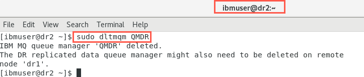

1. Switch to **dr1**. You will assume the secondary node has been replaced. Determine the command that needs to be run on the new Secondary node. On node **dr1**, run the command:
	
	```
	sudo rdqmdr -m QMDR -d
	```
	
	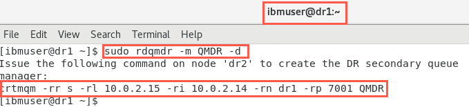
	
1. On node **dr2**, turn on **ens36** network adapter with the following command:


	```
	sudo nmcli con up ens36
	```
	
1. Verify that the adapter has reconnected with following command:

	```
	nmcli device status
	```
	
	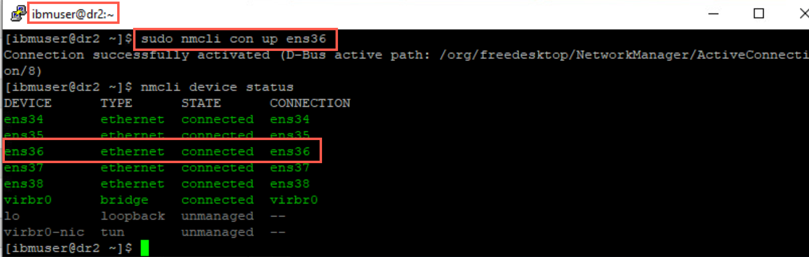

1. Copy this command, that was displayed on **dr1** into the command line of the new Secondary node, **dr2**, then run it:
	
	```
	sudo crtmqm -rr s -rl 10.0.2.15 -ri 10.0.2.14 -rn dr1 -rp 7001 QMDR
	```
	
	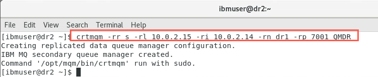
			
1. Confirm the status of the DR configuration on both nodes:
	
	```
	sudo rdqmstatus -m QMDR
	```
	
	On **dr2**:
	
	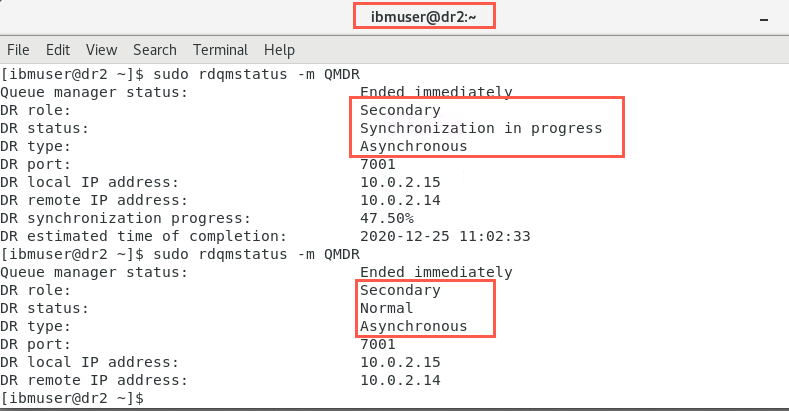
	
	On **dr1**:
	
	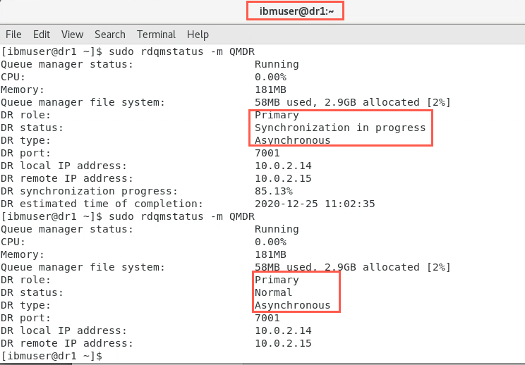
	
	Wait for synchronization to complete - *DR status = Normal* before continuing.
	
## Reverting to a snapshot

Suppose a network connection between the nodes is lost; the changes to the persistent data for the primary instance of a queue manager are tracked. When the network connection is restored, a synchronization process is used to get the secondary instance up to speed as quickly as possible.

While synchronization is in progress, the data on the secondary instance is in an inconsistent state. A snapshot of the state of the secondary queue manager data is taken.

If a failure of the main node or the network connection occurs during synchronization, it would be necessary to revert the secondary instance back to this snapshot.

### Create a snapshot

You will first create an inconsistent state on your DR nodes.

1. On **dr1** in the terminal (as ibmuser) run the runmqsc command. 
	
1. Create a local queue for placing messages to provide some data for later synchronization. Use the runmqsc command to create a local, persistent queue, called Q1DR.

	```
	runmqsc QMDR
	```
	
	```
	DEFINE QLOCAL(Q1DR) DEFPSIST(YES) MAXDEPTH(100000) REPLACE
	```
	
	```
	end
	```
	
	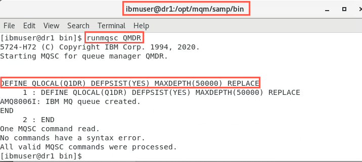

1. Check that the status on both nodes is normal.
	
	```
	sudo rdqmstatus -m QMDR
	```
	
1. In this section you will simulate a failure of the DR replication network adapter. You will simulate the outage as you did before by turning off the *ens36* adapter on **dr1** when instructed to do so.
	
1. In the *ibmuser* window on **dr1**, start putting some messages onto the queue. Use the amqsblst sample to do this with the following commands:
	
	```
	cd /opt/mqm/samp/bin
	```
	
	```
	./amqsblst QMDR Q1DR -W -s 1000 -c 100000
	```
	
	The output should look similar to the following:
	
	

	
1. Before all the messages have been put onto the queue (approimately 50,000 messages), turn off the *ens36* network adapter in the network settings. 

	```
	sudo nmcli con down ens36
	```
	
	This will simulate a network outage on node **dr1**. There will be a short pause, then the placing of messages will resume.
	
	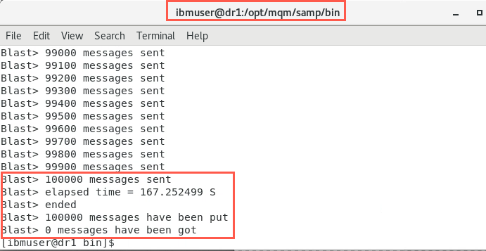

	
1. As user *ibmuser*, check the status on both nodes.
	
	```
	sudo rdqmstatus -m QMDR
	```
	
	Notice on node **dr1**, the DR status is showing as ‘Remote unavailable’.
	
	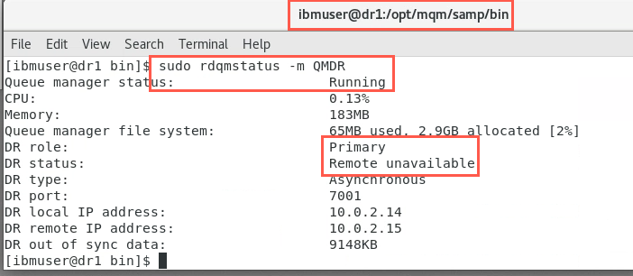
	
	Similarly, on node **dr2**:
	
	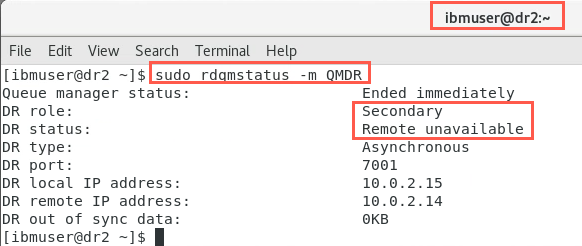
	
1. Issuing the command again on node **dr1**, when all the messages have been placed on the queue, you will notice the ‘DR out of sync data’ has changed. Your number will be different than the screenshot.
	
	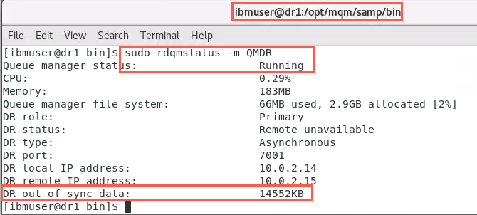
	
  **NOTE:** When you restore the network, synchronization will complete very quickly. If you don't display the status immediately you may not see the 'synchronization in progress' message. Be ready to run the status command as soon as you flip the network switch to *ON*. Once you run the status commands, immediately turn the switch *OFF* again.

1. Simulate the restoration of the network outage on node **dr1** by turning on the *ens36* adapter in network settings. 

	```
	sudo nmcli con up ens36
	```
	
1. The nodes will start synchronizing as soon as this happens. Check the status on both nodes immediately, before switching off the network. They will look similar to the following:
	
	```
	sudo rdqmstatus -m QMDR
	```
	
	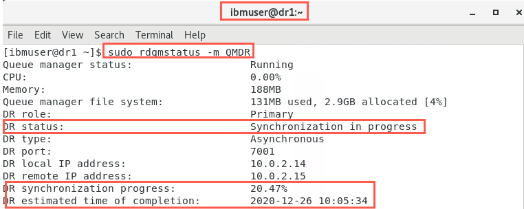

	
	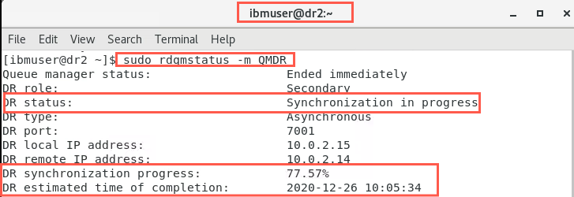	
1. Immediately (before synchronization is *complete*), simulate a network outage on node **dr1** again by turning off the *ens36* adapter in network settings.
	
1. When the network is detected to have failed again, the status on the primary node, **dr1** goes back to ‘Remote unavailable’ and the amount of data that is out of synchronization.
	
	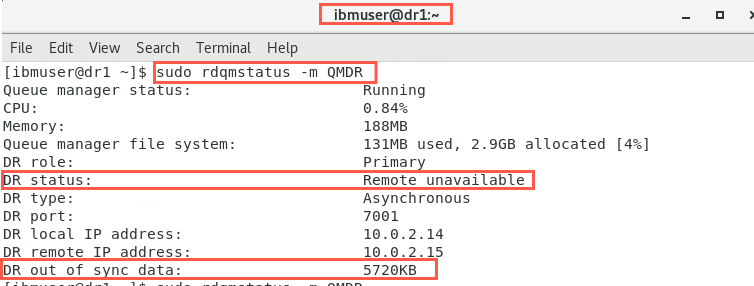

	The status on the secondary node, **dr2** is ‘Inconsistent’.	
	
		
### Revert to a snapshot

You will now see how the secondary instance reverts to its snapshot and the queue manager data. Note any updates that have happened since the original network failure, however, will be lost.

1. The assumption now is that the Primary node is no longer usable, so the replication node must be made the new Primary instance. On the secondary node **dr2**, in the **root** user terminal, designate **dr2** as the primary instance:
	
	```
	sudo rdqmdr -m QMDR -p
	```
	
1. Due to its former ‘Inconsistent’ state, **dr2** will revert to a snapshot. Check the status to confirm this.
	
	```
	rdqmstatus -m QMDR
	```
	
	The output should look like the following:
	
	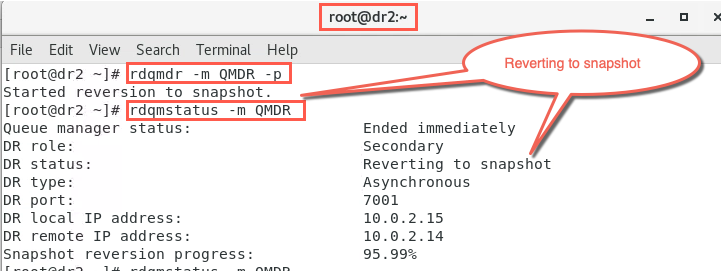

1. When node **dr2** has completed reverting to the snapshot check the status again.

	```
	rdqmstatus -m QMDR
	```
	
	It should look similar to the following:
	
	
	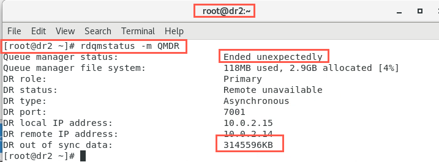
	
	Notice the status indicates the queue manager ‘*Ended unexpectedly*', and there is data that is out of synchronization.
	
1. As this situation would have occurred as a result of a possible failure of the Primary node, in reality you would go through the process described earlier to *Add the new Primary node into the DR configuration*.

	Once the new Primary node was part of the DR configuration again, you would follow the steps to ‘Restore the original DR configuration’ of the Primary node, being the primary instance of the queue manager.
	
	Here you will simulate something similar. You will start the queue manager on node **dr2**. You will delete the queue manager on node **dr1**, and go through the latter of the steps mentioned above again, to show some additional screens not seen previously.
	
	Wait for the reversion process to complete before continuing.
	
	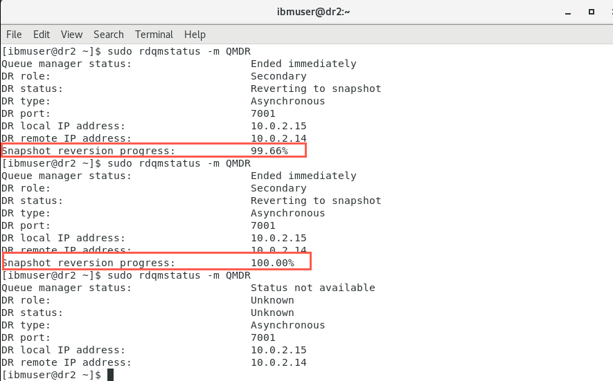
	
1. Start the queue manager on node **dr2**, which is now the primary instance.
	
	```
	strmqm QMDR
	```
	
1. Confirm the queue manager on node **dr2** is running as the primary instance by checking the status.
	
	```
	rdqmstatus -m QMDR
	```
	
	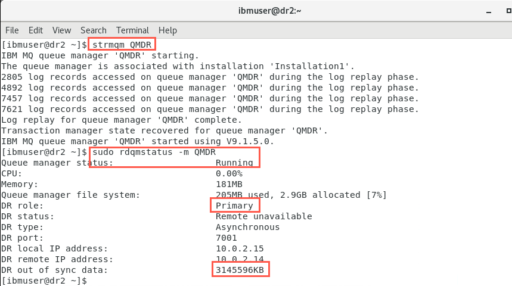

	Notice that as a result of reverting to a snapshot there is data out of synchronization.

1. ‘Simulate’ the replacement of node **dr1**. On node **dr1**, in the *ibmuser* window, stop the queue manager:
	
	```
	endmqm QMDR
	```

1. Confirm the queue manager on node **dr1** ended normally by checking the status
	
	```
	rdqmstatus -m QMDR
	```
	
1. In the **root** terminal, delete the queue manager on node **dr1**.
	
	```
	dltmqm QMDR
	```
	
	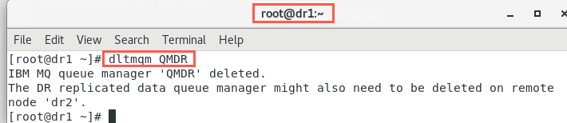
	
1. On node **dr1**, restart the network interface by turning on the *ens36* adapter in network settings.
	
1. On node **dr2**, enter the command to determine the command needed to recreate the queue manager on node dr1.
	
	```
	sudo rdqmdr -m QMDR -d
	```
	
	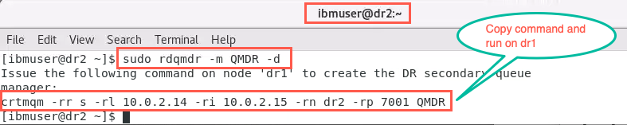

1. On node **dr1**, as user **root**, issue the command to recreate the queue manager:
	
	```
	sudo crtmqm -rr s -rl 10.0.2.14 -ri 10.0.2.15 -rn dr2 -rp 7001 QMDR
	```
	
	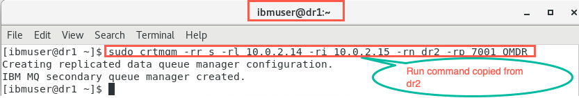
	
1. Check the status on both nodes:
	
	```
	sudo rdqmstatus -m QMDR
	```
	
	On **dr1**:
	
	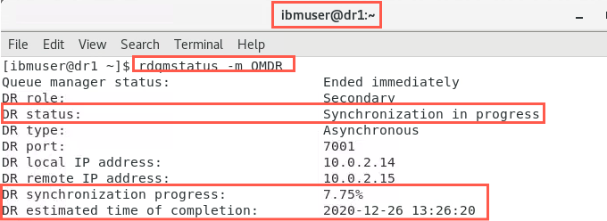
	
	On **dr2**:
	
	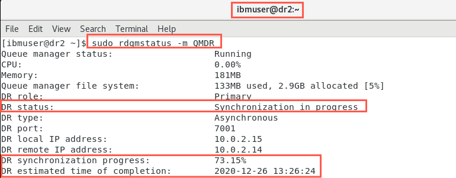
	
	Notice that synchronization of data is taking place between the nodes. Indications are given on its progress and estimated completion time.
	
1. When data synchronization has completed the status of the nodes will look similar to the following:

	On **dr1**:
	
	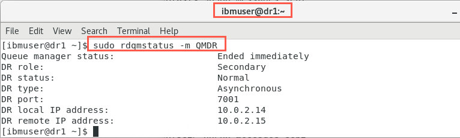
	
	On **dr2**:
	
	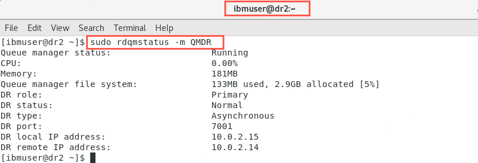
	
1. Restore the DR configuration. On node **dr2**, as *ibmuser*, stop the queue manager:
	
	```
	endmqm QMDR
	```
	
1. Make node **dr2** the secondary instance:
	
	```
	sudo rdqmdr -m QMDR -s
	```
	
	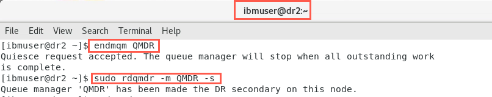
	
1. On node **dr1**, as user **root**, make it the primary instance of the queue manager:
	
	```
	sudo rdqmdr -m QMDR -p
	```

1. Start the queue manager on node **dr1**:
	
	```
	strmqm QMDR
	```
	
	

1. Confirm the DR configuration by checking the status on both nodes:
	
	```
	sudo rdqmstatus -m QMDR
	```
	
	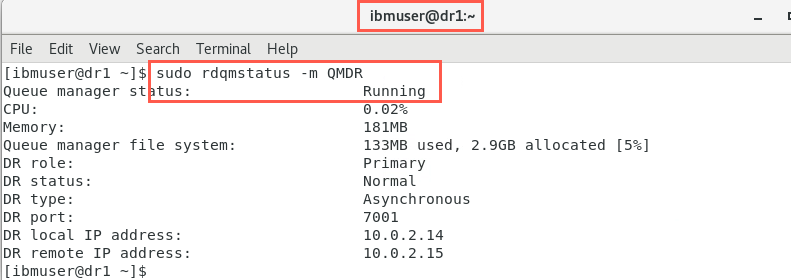
	
	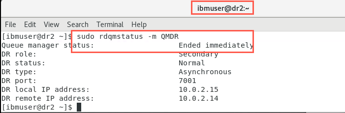

## Delete a DR RDQM

If Disaster Recovery is no longer required for a queue manager, the queue manager needs to be deleted to be removed from the DR configuration. This is achieved as follows:

1. On **dr1** stop the queue manager:
	
	```
	endmqm QMDR
	```
	
1. View the status to confirm that has happened :
	
	```
	sudo rdqmstatus -m QMDR
	```
	
	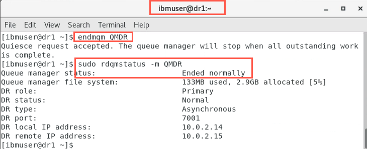

1. On **dr1** remove the queue manager:
	
	```
	sudo dltmqm QMDR
	```
	
1. Viewing the status:
	
	```
	sudo rdqmstatus -m QMDR
	```
	
	will confirm the queue manager no longer exists on the primary node.
	
	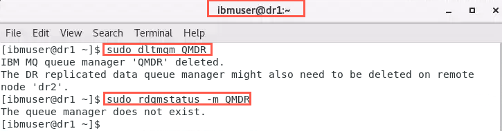
	
1. Also remove the queue manager on **dr2**:
	
	```
	sudo dltmqm QMDR
	```

1. Again, viewing the status:
	
	```
	sudo rdqmstatus -m QMDR
	```
	
	will confirm the queue manager no longer exists on the secondary node either.
	
	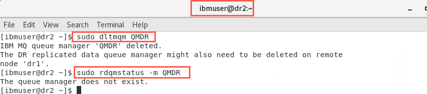
	
## Cleanup environment 

Before continuing to Lab 4, you must clean the environment by removing any RDQM definitions.

1. On **dr1**, open a terminal window and stop running queue managers. Issue the following commands. Your displays and queue managers may not match the screenshots. Substitute your queue managers.


	```
	dspmq -o all 
	```
	
	There should not be any remaining queue managers, but if you have defined any then stop and delete the queue managers.
	
	```
	endmqm xxxx
	sudo dltmqm xxxx
	```
	
	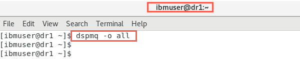
		
1. On **dr2**, open a terminal window and stop running queue managers. Issue the following commands. Your displays and queue managers may not match the screenshots. Substitute your queue managers.

	```
	dspmq -o all 
	```
	There should not be any remaining queue managers, but if you have defined any then stop and delete the queue managers.
		
	```
	endmqm xxxx
	sudo dltmqm xxxx
	```
		
	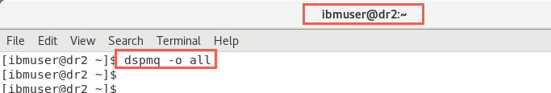

	
## CONGRATULATIONS! 
### You have completed this hands-on lab.

You have created replicated data queue managers to provide disaster recovery for IBM MQ. 


[Continue to Lab 4](mq_ha_pot_lab4.html)

[Return MQ HA Menu](mq_ha_pot_overview.html)