# Introducing IBM MQ Replicated Data Queue Manager - DR for HA Group

## DR for HA Overview

You can configure a replicated data queue manager (RDQM) that runs on a high availability group on one site, but can fail over to another high availability group at another site if some disaster occurs that makes the first group unavailable. This is known as a DR/HA RDQM.

A DR/HA RDQM combines the features of a high availability RDQM (Lab 2) and a disaster recovery RDQM (Lab 3).  The following diagram shows an example DR/HA RDQM.

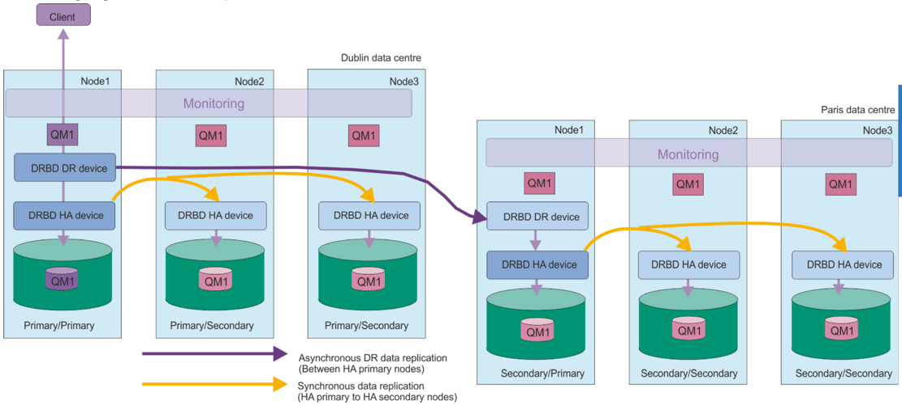

The replication between the DR/HA RDQMs on the main site and the disaster recovery site is always asynchronous. With asynchronous replication, operations such as MQ PUT or GET complete and return to the application before the event is replicated to the secondary queue manager.

You can have two active sites rather than 'main' and 'recovery' sites, if required, so some of your DR/HA RDQMs run on one site and some on the other during normal operation. If a disaster occurs and one site becomes unavailable, then all DR/HA RDQMs run on the same HA group at the same site. You will demonstrate this in the lab. 

Each HA group is configured in the same way as an ordinary HA group. You can define floating IP addresses for a DR/HA RDQM in each HA group. The floating IP address can be the same or different for each HA group.

You cannot upgrade an existing RDQM to be a DR/HA RDQM, you must create a DR/HA RDQM. (If required, you could back up the data of an existing RDQM, delete it, recreate it as a DR/HA RDQM, and then restore the data.)

To configure DR/HA RDQMs, you must complete the following major steps:

1. Configure an HA group on the 'main' site.
1. Configure an HA group on the 'recovery' site.
1. Create a primary/primary DR/HA RDQM on one node of the HA group in the 'main' site.
1. Create primary/secondary DR/HA RDQMs on the other two nodes in the 'main' site.
1. Define a floating IP address for an application to access the DR/HA RDQM when it is running on any of the nodes of the HA group on the 'main' site.
1. Create a secondary/primary DR/HA RDQM on one node of the HA group on the 'recovery' site.
1. Create secondary/secondary DR/HA RDQMs on the other two nodes in the 'recovery' site.
1. Define a floating IP address for an application to access the DR/HA RDQM when it is running on any of the nodes of the HA group on the 'recovery' site.
	  
This lab is concerned with demonstrating the failover of an HA group to an HA group running in a DR site. This requires that the DR site has three equivalent nodes running in the DR site. 

## Lab Introduction

* Seven virtual machines running in IBM TechZone - six RHEL 7.7 x86_64 systems and one Windows desktop:

	* rdqm1	-	This will be our primary node.
	* rdqm2	-	This will be a secondary node.
	* rdqm3	-	This will be another secondary node.
	* dr1		-	DR Fail over primary node.
	* dr2		-	DR Fail over secondary node.
	* dr3		-	DR Fail over other secondary node.
	* mq-pot  -	Windows desktop for connecting to the six RHEL machines.
	 
* VMWare virtual networks primary HA group: 

	|Name   | Type | TechZone Network |  Subnet  | DHCP |
	|:-----:|:--------:|:--------:|:-----:|:-----:|
	| ens34 | Administration | ens34 | 10.0.0.0 | no |
	| ens35 | HA Replication | ens35 | 10.0.1.0 | no |
	| ens36 | DR Replication | ens36 | 10.0.2.0 | no |
	| ens37 | HA primary | ens37 | 10.0.3.0 | no |
	| ens38 | HA secondary | ens38 | 10.0.4.0 | no |

* Network interfaces for HA group:

	|Interface Purpose | Interface Name |  rdqm1 (Primary node)  | rdqm2 (Secondary node) | rdqm3 (Secondary node) |
	|:------:|:--------:|:--------:|:-----:|:--------|
	|MQ Fixed IP | ens35   | 10.0.1.1 |10.0.1.2 |10.0.1.3 |
	|MQ Floating IP | |10.0.1.20 | 10.0.1.20 |10.0.1.20|

	HA interfaces are used as follows: 
	
	* HA Primary - to monitor the nodes in the cluster
	* HA Alternate - backup for monitoring the cluster if the HA Primary network fails
	* HA Replication - for synchronous data replication (the higher the bandwidth the better and the lower the latency the better)
	
* VMWare Workstation virtual networks secondary DR HA group: 

	|Name   | Type | TechZone Network |  Subnet  | DHCP |
	|:-----:|:--------:|:--------:|:-----:|:-----:|
	| ens34 | Administration | ens34 | 10.0.0.0 | no |
	| ens35 | HA Replication | ens35 | 10.0.1.0 | no |
	| ens36 | DR Replication | ens36 | 10.0.2.0 | no |
	| ens37 | HA primary | ens37 | 10.0.3.0 | no |
	| ens38 | HA secondary | ens38 | 10.0.4.0 | no |

* Network interfaces for DR HA group:

	|Interface Purpose | Interface Name |  dr1 (Primary node)  | dr2 (Secondary node) | dr3 (Secondary node) |
	|:------:|:--------:|:--------:|:-----:|:--------|
	|MQ Fixed IP | ens35   | 10.0.1.14 |10.0.1.15 |10.0.1.16 |
	|MQ Floating IP | |10.0.1.20 | 10.0.1.20 |10.0.1.20|

	HA interfaces are used as follows: 
	
	* HA Primary - to monitor the nodes in the cluster
	* HA Alternate - backup for monitoring the cluster if the HA Primary network fails
	* HA Replication - for synchronous data replication (the higher the bandwidth the better and the lower the latency the better)

* Dedicated volume group "drbdpool" containing a single physical volume on each node for RDQM, but please note, you will not see any further reference to this in this document.

* The following groups configured: 

	* **mqm** to allow user to run specific MQ commands 
	* **haclient** to allow user to run HA-specific commands

* A normal user "ibmuser" has been defined for running applications and MQ commands.

	|Name   | Password |  Purpose | Group |
|:-----:|:--------:|:--------:|:-----:|
| root | IBMDem0s! | superuser |  |
| ibmuser | engageibm | host vm user - mq user |mqm     |


* Firewall (firewalld) enabled, and ports 1500 & 1501 will be defined during the lab.

* The following Pacemaker dependencies have already been installed. This list should be sufficient for a standard installation of RHEL 7.7 Server or Workstation. For your own environment setup, or if you are using some other installation, additional packages may be needed:

	* cifs-utils
	* libcgroup
	* libtool-ltdl
	* lm_sensors-libs
	* lvm2
	* net-snmp-agent-libs
	* net-snmp-libs
	* nfs-utils
	* perl-TimeDate
	* psmisc
	* redhat-lsb-core

Depending on your security configuration, there are three different ways to configure the RDQM feature:

1. The simplest way is if the mqm user can ssh between the three nodes of the cluster without a password and can sudo to run the necessary commands.

2. The intermediate option is if the mqm user can sudo but not ssh. It is preferable if the actual users are also in the haclient group. 

3. The default is that the mqm user cannot ssh or sudo. 

In this lab, instructions are provided to setup and test using the intermediate method. 

## Setup the RHEL image (pre-configured on IBM TechZone):

In the TechZone environment, there are six virtual machines: rdqm1, rdqm2, rdqm3, dr1, dr2, and dr3 which currently should be in a powered on state.

1. Click the *VM Remote Console* button for **rdqm1**.

	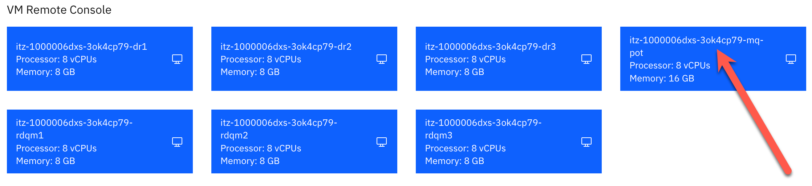 

1. When the desktop appears, click the *Open in a new window* button. 

	
	
1.	A new browser tab is opened. 

	
	
1. You will use *putty* to connect to each of the RHEL VMs. Double click the *putty* icon on the desktop.

	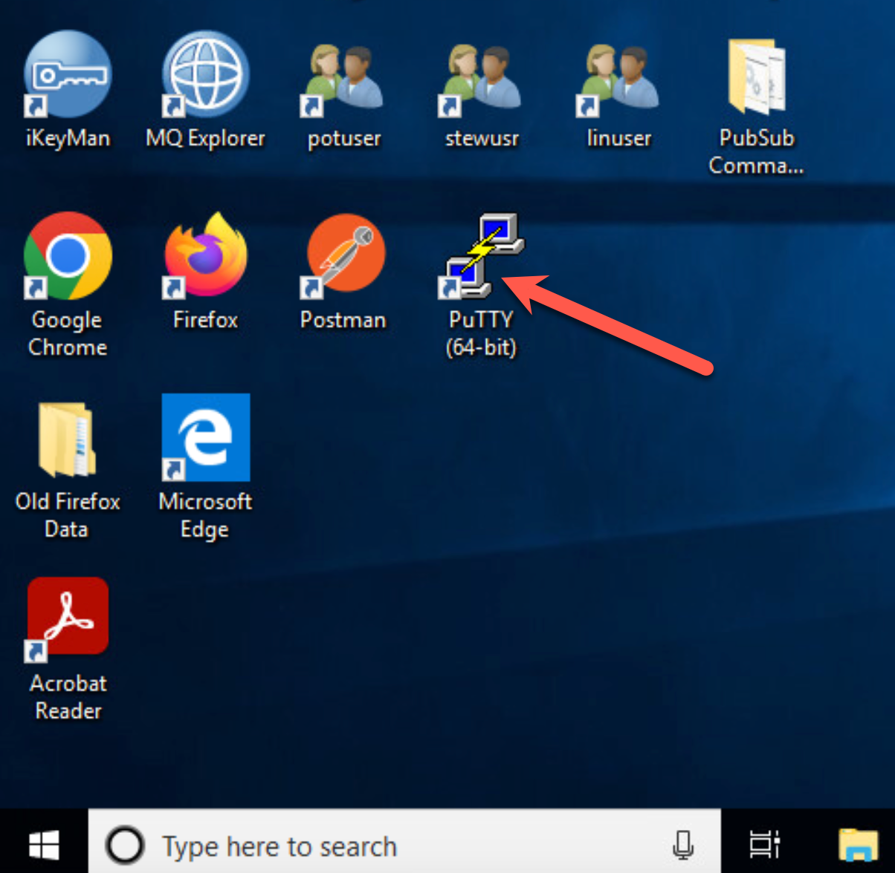
	
1. The IP address for *rdqm1* is **10.0.0.1**. Enter that address in the *Host Name* field and click *Open*. 

	
	
1. If you receive a pop-up saying *host key is not cached*, click *Accept*.
	
	
	
1. A new terminal window appears:

	
	
1. Log on to the VM as user **ibmuser**, using password **engageibm**. 

	
	
1. Open new *putty* windows **rdqm2** and **rdqm3** using 10.0.0.2 for rdqm2 and 10.0.0.3 for rdqm3. 

	

1. Also open new *putty* windows **dr1** (10.0.0.14), **dr2** (10.0.0.15), and **dr3** (10.0.0.16).

	

1. You will use the putty terminal windows for interactions with the RHEL VMs. When instructed to open a additional terminals for a VM, just open another *putty* window for that VM.	

### Pre-configuration steps 

The following steps are necessary for configuring RDQM. They have **already been completed** on the VMs. 

* Extract and Install MQ  

	The code is provided as a compressed tar file in the directory /home/ibmuser/.
	
* Install the MQ and RDQM code 

	RDQM is a single feature which now supports HA and/or DR. The RDQM support requires the Server and Runtime packages. 	

* Configure the RedHat firewall 

	If there is a firewall between the nodes in the HA group, then the firewall must allow traffic between the nodes on a range of ports. Open another terminal, switch to user root, and run the sample file.

* Configure the OS storage settings 

	If the system uses SELinux in a mode other than permissive, you must run the following command:

	   ```
	    semanage permissive -a drbd_t
	   ``` 
	
* Configure groups 

	To create, delete, or configure replicated data queue managers (RDQMs), you must use a user ID that belongs to both the mqm and haclient groups. 
	
	If you want to allow a normal user in the mqm group to create RDQM instances etc., you need to grant the user access to certain commands via sudo. 	
	You will add the mqm user to the root and haclient group. Then add root and ibmuser to the mqm and haclient groups. 
  	
* Create the Logical Group for the QM data 

	Each node requires a volume group named drbdpool. The storage for each replicated data queue manager is allocated as a separate logical volume per queue manager from this volume group. For the best performance, this volume group should be made up of one or more physical volumes that correspond to internal disk drives (preferably SSDs). 
	
The above steps must be completed on each node before RDQM can be configured. At this point, you are ready to begin RDQM configuration. 


## Configure RDQM

This lab assumes that HA and DR have not been configured. If you have attempted or completed either of the previous labs (2 - 3) using this TechZone environment, you must ensure that all RDQM queue managers have been deleted and the Pacemaker cluster removed using the Cleanup instructions at the end of Lab 2 (HA) and Lab 3 (DR). If you did not complete the Cleanup instructions in the previous labs, do so now before continuing with this lab.

If you have not attempted or completed the previous labs using this TechZone environment, you should continue here. If you already completed those labs and RDQM support installed on rdqm1, skip ahead to [Configure RDQM support](#confhadr).

### Install RDQM support
	
As previously stated, MQ has already been installed on all VMs *except* **rdqm1**. The advanced feature RDQM support has also been installed on all the VMs *except* on **rdqm1**. You will need to install RDQM support on **rdqm1** so you can see how easy it is to install. You will review the requirements for RDQM and scripts for installation and configuration.

1. On **rdqm1** change the directory to the preconfigured directory **mqrdqm**.

	```
	cd mqrdqm
	```

1. The MQ install media has been previously downloaded to /home/ibmuser/Download directory. Enter the following command to extract the installation media.

	```
	sudo tar -zxvf ~/Downloads/IBM_MQ_9.3.1_LINUX_X86-64.tar.gz
	```
	
	If prompted, enter root's password *IBMDem0s!*.
	
	
	
1. As a result, a new subdirectory **MQServer** has been created in the **mqrdqm** directory. Change to the **MQServer** directory and list the contents. You will find all the MQ RPM files for installing.

	```
	cd MQServer
	ls
	```

	
	
To install support for RDQM (replicated data queue managers), you complete the following tasks:

* Install DRBD on each node.
* Install Pacemaker on each node.
* Install IBM MQ on each node.
* Install RDQM on each node.

#### Install RDQM prereqs

The DRBD and Pacemaker RPM packages are supplied on the IBM MQ media. You should install the versions supplied with IBM MQ. Do not download your own versions. 

1. The DRBD and Pacemaker packages are signed with the LINBIT GPG key. Use the following command to import the public LINBIT GPG key:

	```
	sudo rpm --import https://packages.linbit.com/package-signing-pubkey.asc
	```
	
	

	For supported levels of RHEL 7, the components are found under the Advanced/RDQM/PreReqs/el7/ directory. For supported levels of RHEL 8, components are found under the Advanced/RDQM/PreReqs/el8/ directory. For supported levels of RHEL 9, components are found under the Advanced/RDQM/PreReqs/el9/ directory. We are using RHEL 7.7 VMs for this lab.	
	
1. Change to the Advanced/RDQM/Prereqs/el7 and list the members of directory *el7* to see the important prerequisites of RDQM.
	
	```
	cd Advanced/RDQM/PreReqs/el7
	ls
	```
	
	
	
	Here you see directories for Pacemaker and DRBD. If you drill into those subdirectories, you will see the RPM packages for installing these prerequisites.
	
1. Determine which DRBD kernel module is needed for the system on which RDQM is being installed. For example, on a RHEL 7 system, running the helper script Advanced/RDQM/PreReqs/el7/kmod-drbd-9/modver returns the kernel module that you need to install. Run the following command to identify the module:
	
	```
	./kmod-drbd-9/modver
	```
	
	
	
	Verify that the module for RHEL 7 is **kmod-drbd-9.1.11_3.10.0_1062-1.x86_64.rpm**. Copy the value returned to be used for the first installation command.
	
1. Change back to the MQServer directory with the following command: 

	```
	cd ~/mqrdqm/MQServer
	```
	
1. Install the appropriate DRBD kernel module that you identified in run the following command:
	
	```
	sudo yum install Advanced/RDQM/PreReqs/el7/kmod-drbd-9/kmod-drbd-9.1.11_3.10.0_1062-1.x86_64.rpm
	```
	
	
	
	Reply **y** to confirm the installation. After a few minutes and numerous messages, the script will show *Complete!*.
	
		
1. In the same terminal window, install the required DRBD utilities for RHEL 7 with the following command:

	```
	sudo yum install Advanced/RDQM/PreReqs/el7/drbd-utils-9/*
	```
	
	
	
	Reply **y** to confirm the installation. This command runs faster with fewer messages, the script will show *Complete!*. 

	

1. Install Pacemaker for RHEL 7 with the following command:

	```
	sudo yum install Advanced/RDQM/PreReqs/el7/pacemaker-1/*
	```
	
	
	
	Reply **y** to confirm the installation. The script will show *Complete!*. 

	

	The Pacemaker installer will report any missing packages that also need to be installed before the install can complete successfully.
	
### Install MQ

1. In the same terminal window in the *MQServer* directory, you will continue with the normal installation of MQ on RHEL. First you need to accept the IBM MQ license. Enter the following command:

	```
	sudo ./mqlicense.sh
	```
	
	When prompted, enter **1** to accept the MQ license.
	
	
	
	You are then returned to the command prompt.

1. Install IBM MQ. This is like a standard IBM MQ install. Enter the following:
	
	```
	sudo yum install MQSeries*
	```
	
	
		
	This command will install all of the MQ RPMs in the required order. Reply **y** to confirm the installation when prompted. The script will show *Complete!*.  
	
	
	
1. Once MQ is installed, it is a good idea to set the path for the MQ installation. Enter the following command:

	```
	sudo /opt/mqm/bin/setmqinst -i -p /opt/mqm
	```
	
	
	
1. Now you can finish the installation of IBM RDQM. Enter the following command:
	
	```
	sudo yum install Advanced/RDQM/MQSeriesRDQM*
	```
	
	
		
	This command will install all of the RDQM. Reply **y** to confirm the installation when prompted. The script will show *Complete!*.  
	
	
		
	RDQM is now ready as it has been installed with the prereqs on all of the VMs.
	
### Configure the firewall

Normally, the firewall is configured during the pre-req installations.  

1. As root on **rdqm1** start the firewall with following command:

	```
	sudo systemctl start firewalld
	```

1. To verify that the MQ, DRDB, and Pacemaker ports are opened in the firewall, run the following commands:

	```
	cd /usr/lib/firewalld/services/
	```
	
		
	
	```
	cat rdqm-mq.xml
	cat rdqm-drbd.xml
	cat rdqm-pacemaker.xml
	```
	
	
	
1. Normally you would repeat the above steps on the other VMs, but it is not necessary for this lab as it was preconfigured. 

<a name="confhadr"></a>
## Configure the HA and DR - HA clusters

### Configure the HA cluster

The cluster must first be created, and then an RDQM instance defined containing one or more queue managers. The RDQM code expects the rdqm.ini file to be in the /var/mqm directory.
	
1. On node rdqm1, in a terminal window (as **ibmuser**), navigate to /var/mqm. 

1. Copy the provided rdqm.ini file to the */var/mqm* directory with the following command: 

    ```
    cd /var/mqm
    sudo cp ~/mqrdqm/rdqm-hadr.ini rdqm.ini 
    ```
    
    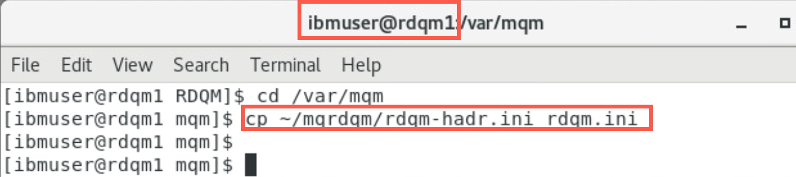
    
1. **IMPORTANT:** Repeat the above commands to copy rdqm-hadr.ini on **rdqm2** and **rdqm3** before continuing.

1. Display the rdqm.ini file.

	```
	cat rdqm.ini
	```
	
	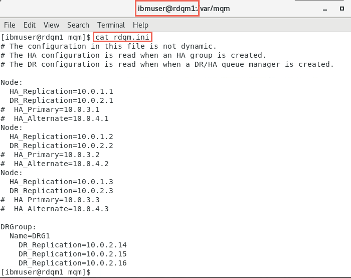
	
	If you have done the previous labs this file should look familiar. Let's review the configuration before we continue. 
	
	This file must be the same on all the primary HA VMs. The Node stanzas define the addresses to be used for HA_Replication and DR_Replication. For each parameter, the subnet used must be the same on all three nodes. 
	
	DRGroup stanza is new in MQ 9.1.5 which defines the IP addresses to be used for DR_Replication to the secondary DR site. The name is DRG1 and uses the same subnet (10.0.2.x) used by the local DR_Replication parameters. 
	
	This allows the entire HA cluster to fail over to another like HA cluster at the DR site. This would be used if the primary HA site was not available.
	

1. Return to **rdqm1** and enter the command to configure RDQM on the primary machine:

	```
   sudo rdqmadm -c 
   ```
    
    Wait for the configuration to complete, approximately two minutes.
    
1. You have received the messages that the replicated data system has been configured on this node and also on remote nodes **rdqm2** and **rdqm3**. You also receive a message that says configuration is complete for your HA group at the primary site.

	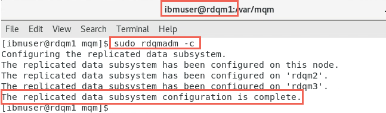
    
	The RDQM HA pacemaker cluster is now ready.
	
### Configure the DR - HA cluster

The simulated disaster recovery site has been preconfigured. Let's review the configuration in relation to the simulated high availability site. We will refer to the main HA site as primary and the DR site as secondary.  

1. Sign in to **dr1** just as you have done for the rdqmx VMs using the same credentials.

1. Change the directory to */var/mqm*. Then copy rdqm-hadr.ini to rdqm.ini as you did previously. But since dr1, dr2, and dr3 are at the recovery or secondary site, the values for this HA group are reversed.

	```
	cd /var/mqm
	cp ~/mqrdqm/rdqm-hadr.ini rdqm.ini
	```
	
1. Display the *rdqm.ini* file. This file is the same on all of the VMs for the DR site; dr1, dr2 and dr3. This file will be used to create another HA group at the secondary site.

	```
	cat rdqm.ini
	```
	
	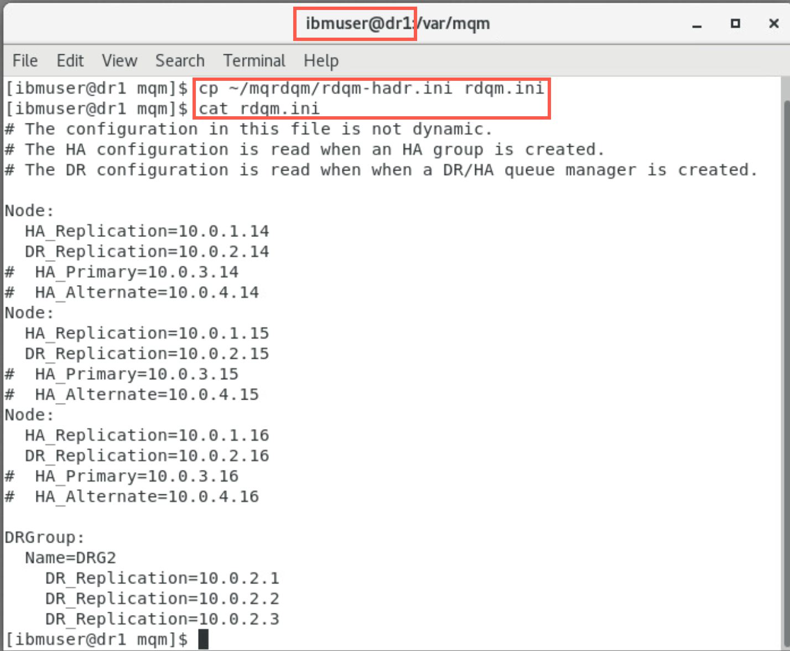
	
	The secondary HA cluster must be configured using the same subnets as the primary HA cluster. You will notice that the node definitions for the secondary site have the local IP addresses for dr1, dr2, and dr3. The HA-Replication subnet (10.0.1.x) is the same subnet for HA_Replication on the primary site. Likewise the DR-Replication subnet (10.0.2.x) is the same subnet for DR-Replication on the primary site.
	
1.	**IMPORTANT:** Repeat the above commands to copy rdqm-hadr.ini on **dr2** and **dr3** before continuing.

	This file must be the same on all the secondary DR VMs. The Node stanzas define the addresses to be used for HA_Replication and DR_Replication. For each parameter, the subnet used must be the same on all three nodes. 
	
	DRGroup stanza is new in MQ 9.1.5 which defines the IP addresses to be used for DR-Replication to the secondary DR site. The name is DRG2 to distinguish it from the DRGroup on the primary site. It uses the same subnet (10.0.2.x) used by the local DR_Replication parameters. 
	
	This configuration allows the primary site to act as the DR site for the secondary site. In this manner you can have active RDQMs running in an HA group at each site and the other site acting as the failover (recovery site) for the other. This provides resiliency where you can have an active / active architecture. When planning for RDQM (not covered in this lab) you must allow enough headroom on each server so that all the queue managers in you RDQM environment can run on one single server. 

1. Return to **dr1** and enter the command to configure the RDQM pacemaker cluster on the DR site:

	```
   sudo rdqmadm -c 
   ```
1. Wait for the configuration to complete, approximately two minutes. You have received a message that the replicated data system has been configured on this node and remote nodes **dr2** and **dr3**. You are also notified that the configuration is complete.

	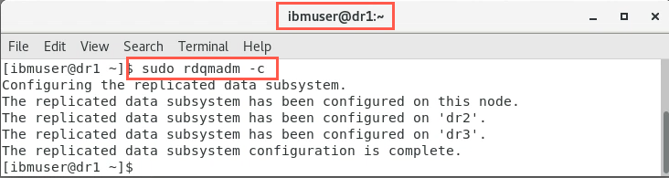
    
	The RDQM DR pacemaker cluster is now ready.
	
## Configure the HA RDQM

### Overview of the steps to create an RDQM

The high availability replicated data queue manager (RDQM) now needs to be created. You use the crtmqm command to create a replicated data queue manager (RDQM) in a DR/HA configuration.

You can create a DR/HA RDQM as a user in the mqm group if the user can use sudo. Otherwise you must create the RDQM as root. User *ibmuser* is a member of the mqm group and is a sudoer.

We will refer to the local (HA) site as primary and the remote (DR) site as secondary. We will also refer to the preferred node as primary and the standby nodes as secondary. 

Therefore primary/primary means that the RDQM is running on the local site on the preferred node and primary/secondary means the RDQM is running on the local site on a failed over node. Conversely secondary/primary means the HA group has failed over to the remote DR site and the RDQM is running on the preferred node of the remote HA group. And finally secondary/secondary means that the RDQM HA group has failed over to the remote DR site and the RDQM is not running on the preferred node of the remote HA group. 

You must create a number of DR/HA RDQMs:

 * On the HA group on the "main" site:
	* On the node where you want the queue manager to run under normal conditions, create the primary/primary DR/HA RDQM.
	* On each of the other two nodes in the HA group, create a primary/secondary DR/HA RDQM.

* On the HA group on the "recovery" site:
	* On the node where the queue manager will run if it fails over to the recovery site, create the secondary/primary DR/HA RDQM. You can use the command output when you created the primary/primary queue manager on the 'main' site.
 * On each of the other two nodes in the HA group, create a secondary/secondary DR/HA RDQM.
* All of the queue manager instances must have the same name and be allocated the same amount of storage.

### Create the RDQM

Let's do it.

The example configuration has two sites, named *main* and *dr*. Each site has three nodes. The main site nodes are named **rdqm1**, **rdqm2**, and **rdqm3**. And at the dr site there are matching nodes named **dr1**, **dr2**, and **dr3**. 

The nodes have full name consisting of their site name and name, so **main-rdqm1**, **dr-dr1**, and so on.

The following steps create a DR/HA RDQM named QMHADR that runs on **main-rdqm1**. The main-rdqm1 node is the HA and DR primary. 

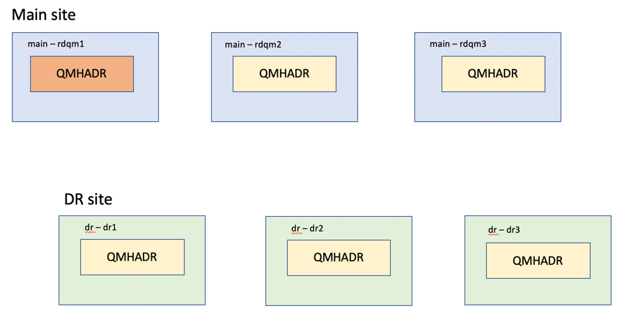

1. If the local and remote DR IP addresses are specified in the rdqm.ini file, then there is no need to specify any IP addresses on the command line and a DR/HA RDQM named QMHADR can be created by running the command on main-rdqm1. All the IP addresses are in the rdqm.ini, so use this command to create a primary/primary DR/HA RDQM queue manager called **QMHADR** with the following command:

	```
	sudo crtmqm -sx -rr p -rn DRG1 -rp 7001 -fs 3 QMHADR
	```
	
	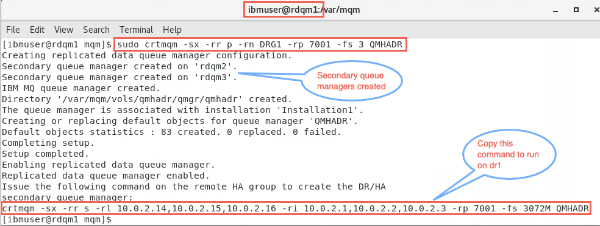
	
	Examples of equivalent command line commands:
	
	* If the local DR IP addresses are not specified in the rdqm.ini file, then the remote DR IP addresses can be specified on the command line:
	
	```
	sudo crtmqm -sx -rr p -ri 10.0.2.14,10.0.2.15,10.0.2.16 -rp 7001 -fs 3 QMHADR
	```
	
	* If no DR IP addresses are specified in the rdqm.ini file, then both remote and local DR IP addresses can be specified on the command line:
	
	```
	crtmqm -sx -rr p –rl 10.0.2.1,10.0.2.2,10.0.2.3 -ri 10.0.2.14,10.0.2.15,10.0.2.16 -rp 7001 QM1
	```
			
1. The primary/primary queue manager has been created. And the command to run on the secondary/primary nodes has been provided.
	
	```
	sudo crtmqm -sx -rr s -rl 10.0.2.14,10.0.2.15,10.0.2.16 -ri 10.0.2.1,10.0.2.2,10.0.2.3 -rp 7001 -fs 3 QMHADR
	``` 
	
1. Copy the provided command provided in the output.
		
1. Return to node **dr1**. In the terminal window, paste the command and  run it.

	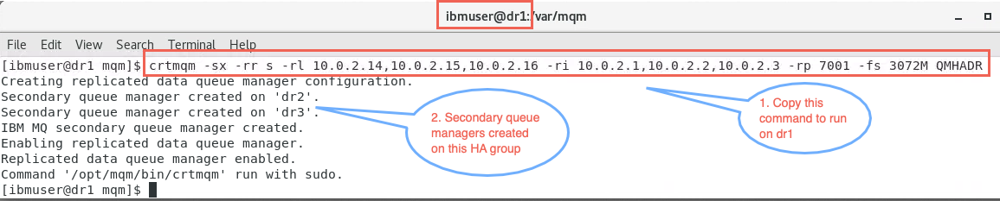
	
	**NOTE:** Be careful when copying / pasting the command from **rdqm1**. On **rdqm1**, copy the command to the VM clipboard, then copy from rdqm1's VM clipboard and paste it into dr1's VM clipboard. Then you can paste the command on the command line in **dr1**. Ask your instructor for assistance if you don't get the correct command pasted.

### Create a floating IP address for the HA / DR queue manager

You can create floating IP addresses for each of your HA groups in a DR/HA RDQM configuration.

A floating IP address enables a client to use the same IP address for a DR/HA RDQM regardless of which node in an HA group it is running on. If your two HA groups have private/isolated networks for application connectivity, then the same floating IP address can be defined for both groups. You must still define that floating IP address twice, however, once on each of your HA groups. 

Since our TechZone template is using one network, we can create one floating IP that can be used on either HA group. The floating IP address must be defined in the same subnet as the HA_Replication parameter in the rdqm.ini file.

1. Return to **rdqm1** and in the terminal window run the following command to create the floating IP.

	```
	sudo rdqmint -m QMHADR -a -f 10.0.1.20 -l ens35
	```
	
	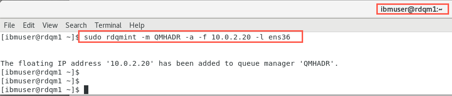
	
	Enter the same command on **dr1**.
	
### Create MQ resources

To run sample programs you will define two queues: for *SOURCE* and *TARGET*. You will also create a new channel using the ‘MQ’ IP address for each of the three nodes in our cluster (as the queue manager could run on any one of them) and the listener port for the queue manager. 

It is recommended to add another listener specifically for the floating point IP address. By default, the standard listener will listen on the same port on every IP address, so a different port needs to be chosen for the additional listener. 

You will define the RDQM with default port 1414 which is already allowed thru the firewall. Since you will add another listener, with a separate port, we need to add that port to the firewall rules. Assign port 1420 to second listener.

You will also turn off CHLAUTH and CONNAUTH completely to keep things simple.

1. On rdqm1 where the QMHADR queue manager is running, in ibmuser's terminal window, run the command:

	```
	runmqsc QMHADR
	```
	
	Run the following MQSC commands (remember that MQ objects are case sensitive):
	
	```
	ALTER QMGR CHLAUTH(DISABLED) CONNAUTH(' ')
	```
	```
	REFRESH SECURITY TYPE(CONNAUTH)
	```
	```
	DEFINE QLOCAL(SOURCE) DEFPSIST(YES)
	```
	```
	DEFINE QLOCAL(TARGET) DEFPSIST(YES)
	```
	```
	DEFINE CHANNEL(CHANNEL1) CHLTYPE(SVRCONN) TRPTYPE(TCP)
	```
	```
	DEFINE CHANNEL(CHANNEL1) CHLTYPE(CLNTCONN) TRPTYPE(TCP) CONNAME('10.0.1.1(1414),10.0.1.2(1414),10.0.1.3(1414)') QMNAME(QMHADR)
	```
	```
	START LISTENER
	```	
	```
	DEFINE LISTENER(FLIP) TRPTYPE(TCP) CONTROL(QMGR) IPADDR(10.0.1.20) PORT(1420)
	```
	```
	START LISTENER(FLIP)
	```
	```
	END
	```
	
	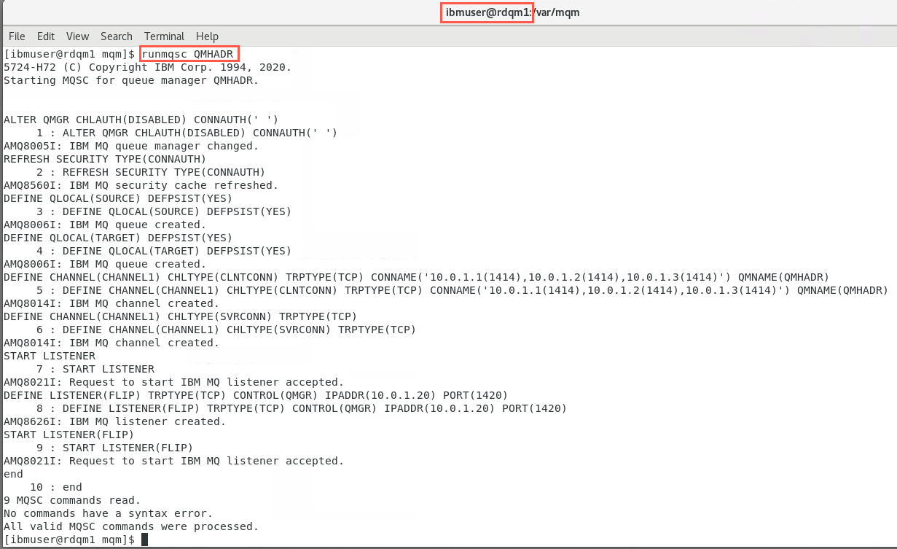
	
1. The new listener will not be started until the queue manager is restarted. To stop the RDQM, enter the following command on the DR/HA RDQM's primary node (rdqm1):
 
	```
	endmqm QMHADR
	```
	
	Pacemaker ceases to manage the RDQM, and then the RDQM is ended. All other *endmqm* parameters can be used when stopping an RDQM.
	
1. Restart the RDQM with the following command on the RDQM's primary node (rdqm1):

	```
	strmqm QMHADR
	```
	
	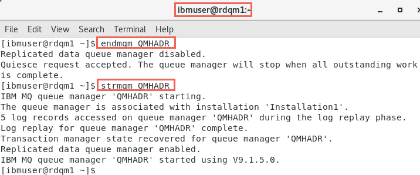
	
	The RDQM is started, and Pacemaker starts managing the RDQM. You must specify the -ns option with strmqm if you want to specify any other strmqm options.
	
1. You can check that both listeners are running by running the following command:
	
	```
	netstat -ant | grep 14
	```

	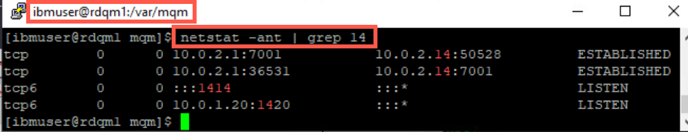
	
	The first listener is the one created because -p **1414** was specified on the *crtmqm* command. This listener is listening on port 1414 on every IP address. The second listener, however, is listening on port **1420** on the floating IP address only.
		
### Update the firewall
   
1. On each of the nodes, open the firewall port defined (1420) for the queue manager.

	```
	sudo firewall-cmd --add-port=1420/tcp
	```
		
1. To verify the ports are now open, enter the following command: 

	```
	sudo firewall-cmd --list-ports
	```

	Results should look like this:
	
	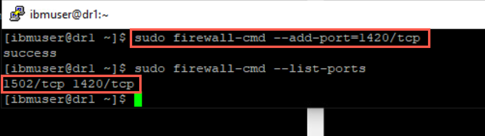
	
	**NOTE:** Your result may differ depending on whether Labs 2 - 3 were previously completed.
	
1. Don't forget, each node must have these ports opened in the firewall. Repeat the firewall update on all other servers - **rdqm2**, **rdqm3**, **dr1**, **dr2**, and **dr3**.
	
1. Now that you have a floating IP address associated with QMHADR, you can change the MQSERVER environment variable to CHANNEL1/TCP/10.0.2.0(1420) when you run applications.

	```
	export MQSERVER='CHANNEL1/TCP/10.0.2.20(1420)'
	```
	

## Simple testing of RDQM

Now that you have two active HA groups, one primary with the primary queue manager and a secondary with the secondary queue manager created, you can proceed to test the failover of the HA group. 

When operating in a DR/HA environment there are separate considerations for high availability and disaster recovery.

If the node on which a DR/HA RDQM is running fails, the RDQM automatically fails over to another node in that HA group. If the entire site fails, then you must manually start the RDQM on the preferred node in the HA group on the recovery site. The considerations here are the same as for an ordinary DR RDQM covered in Lab 3.

### Understanding RDQM status

#### Using dspmq

1. To view the state of an RDQM, enter the following command on **rdqm1**.

	```
	dspmq -m QMHADR
	```
	
	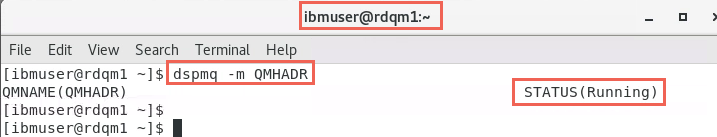
	
	The state information that is output depends on whether you run the command on the RDQM's primary or secondary node. If run on the primary node then one of the normal status messages returned by dspmq is displayed - *Running*. 
	
1. Run the same command on **dr1**.

	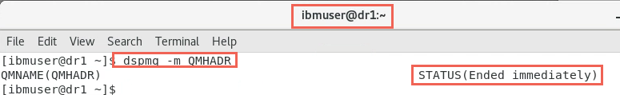

	If you run the command on a secondary node then the status 
	*Ended immediately* is displayed. 
	
1. You can use arguments with *dspmq* to establish whether an RDQM is configured for disaster recovery, and whether it is currently the primary or the secondary instance. Return to **rdmq1** and run the command again with these parameters: 

	```
	dspmq -m QMHADR -o dr
	```
	
	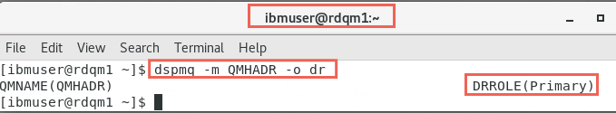
	
	One of the following responses is displayed:

	* DRROLE()
     Indicates that the queue manager is not configured for disaster recovery.
	* DRROLE(Primary)
     Indicates that the queue manager is configured as the DR primary.
	* DRROLE(Secondary)
     Indicates that the queue manager is configured as the DR secondary. 
     
    QMHADR is running on **rdmq1**, so the DRROLE shows *Primary*.
	
1. Run the same command on **dr1**.

	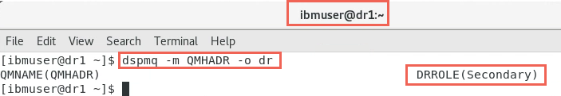
	
	DRROLE shows *Secondary*. 
	
1. Use the *dspmq -o all* command to view the disaster recovery and high availability information for DR/HA RDQMs. For example, if you run dspmq -o all on the node where the DR/HA RDQM is running, **rdqm1**, you see the following state information:

	```
	dspmq -o all
	```
	
	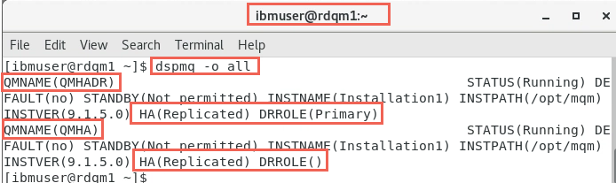
	
	You see that QMHADR is Running and has DRROLE Primary and the HA status is Replicated. 
	Since you specified all, any other queue managers such as QMHA will also appear as Running with HA status as Replicated, but no DRROLE. This is expected if you ran the first Lab 1 where you created the RDQM QMHA which is runnning in an HA cluster but was not defined for DR. 
	
	**NOTE:** When using the dspmq commands, your environment may not look the same as the screen shots. This depends on whether you ran Labs 2 and 3 before this lab and whether you ran the cleanup in those labs. You may also have experimented with other non-RDQM queue managers such as QMJ in the screen shots.
	
1. If you run the same command on **rdqm2**, you see that the display is the same except QMHADR is Running elsewhere. The DRROLE is still Primary because in a DR relationship the *HA cluster* is primary or secondary, not the node.

	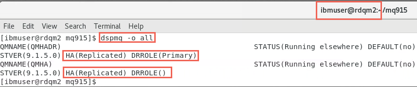
	
1. Run the commmand on **dr1**. 

	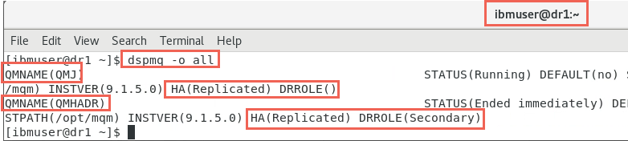
	
	QMHADR is not running so *Ended immediately* is displayed as status. The DRROLE is Secondary as expected and the HA status is replicated. There is another RDQM which is running with no DRROLE and has HA status Replicated. This RDQM is running in the DR site's HA cluster and is not known in the Main site HA cluster.
	
#### Using rdqmstatus
	
You use the rdqmstatus command to view the status of individual RDQMs or get an overview of the status of all the RDQMs known to the HA group.

You must be a user in the mqm and haclient groups to run the rdqmstatus command so the environment has been preconfigured in that way. You can run the command on any of the nodes in either of the HA groups.

1. On **rdqm1** issue the following *rdqmstatus* command.

	```
	sudo rdqmstatus
	```
	
	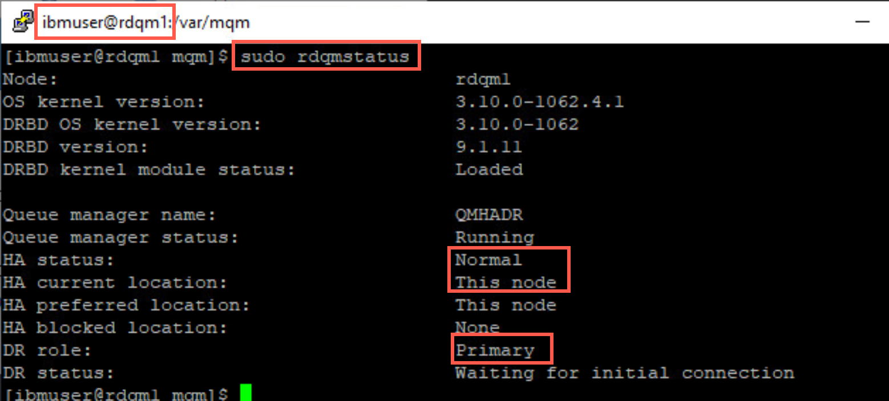
	
	The result is similar to the dspmq display.
	
1. Issue the command on **dr1**.

	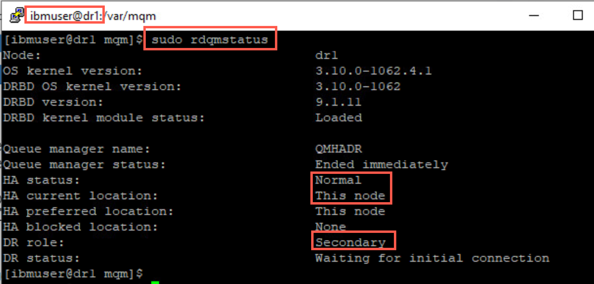
	
	Again the displays are very similar to that of dspmq.
	
1. When you specify the queue manager on the *rdqmstatus* command is where things get interesting. Switch to **rdqm1** and issue the following command.

	```
	sudo rdqmstatus -m QMHADR 
	```
	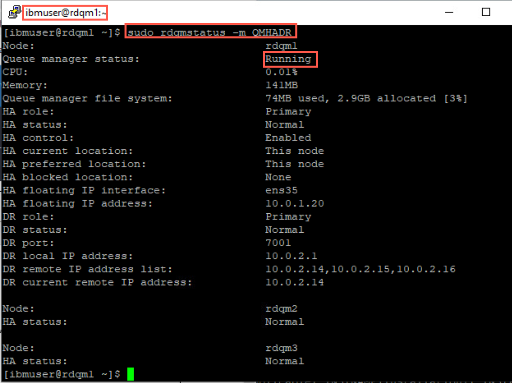
	
	Look closely at the HA and DR fields. The HA role is currently *Primary* (that's why it is running here), HA status is *Normal* and HA control is *enabled*. Both the HA preferred and current locations are *This node*. The HA floating IP interface and address are displayed.
	 
	DR role is *Primary* and status is *Normal*. The DR local replication IP address and port are shown and the list of remote DR IP addresses with the current remote IP address.
	
#### Failing over an RDQM instance to another node

The easiest way to force an RDQM instance to fail over to another node in the local Main site HA cluster is to change its preferred location.

The default location for RDQM is **rdqm1**. You will fail the RDQM instance to Main site node 2, **rdqm2**. 

1. Switch to **rdqm2**. 

1. Open a new terminal window, and as the user ibmuser, issue the command to set the MQ environment. Make this node the primary instance with the following command:

	```
	sudo rdqmadm -m QMHADR -p
	```
		
1. Confirm that **rdqm2** is now the primary node:

	```
	sudo rdqmstatus -m QMHADR
	```
	
	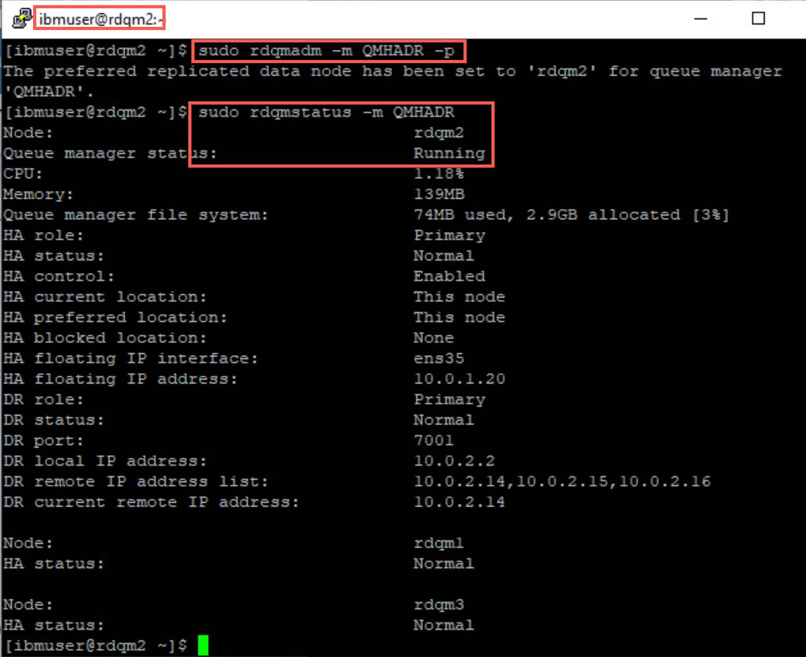
	
1. Now you can move the queue manager back to rdqm1. Return to **rdqm1** and run the **sudo rdqmadm** command again. 

	```
	sudo rdqmadm -m QMHADR -p
	```	
	
	Check the status again to see it is now running on **rdqm1**.
	
	```
	sudo sudo rdqmstatus -m QMHADR
	```
	
	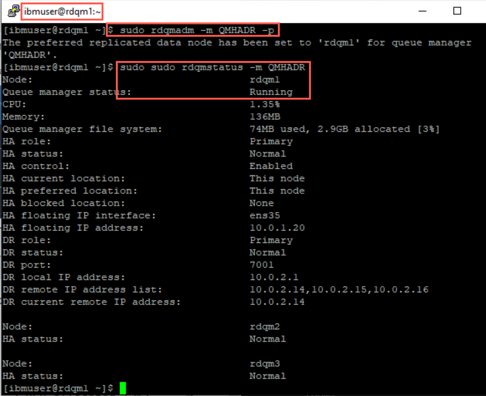

#### 	Move the RDQM by suspending a node

Another test is to move a RDQM by suspending the node on which it is running, as you may want to do when applying a Fix Pack.

1. On the node where QMHADR is running (**rdqm1**), return to ibmuser's terminal window. As the user **ibmuser**, issue the command to suspend the queue manager:
	
	```
	sudo rdqmadm -n rdqm1 –s
	```
	
1. Check the status of the RDQM with the following command:

	```
	sudo rdqmstatus -m QMHADR
	```

	As shown in the display, the replicated data node is suspended and goes into standby.

	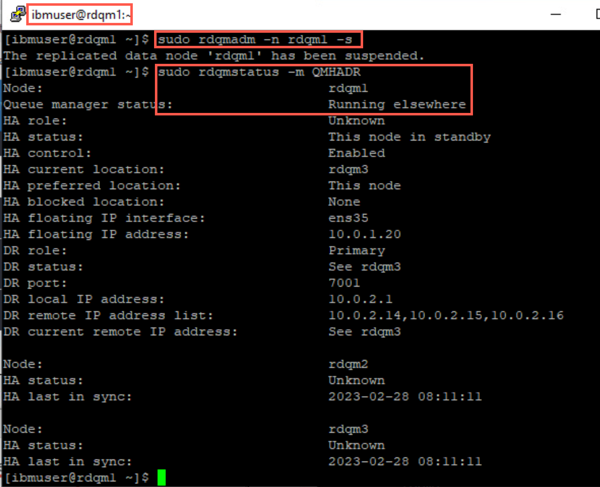
	
1. Pacemaker determines which node to failover to. Switch to **rdqm2** and **rdqm3** and issue the command to display the status of QMHADR. One of the nodes will show QMHADR *Running* and the other will show QMHADR *Running elsewhere*. On both nodes **rdqm1** will be shown as *Remote node in standby*.

	```
	sudo rdqmstatus -m QMHADR
	```
	
	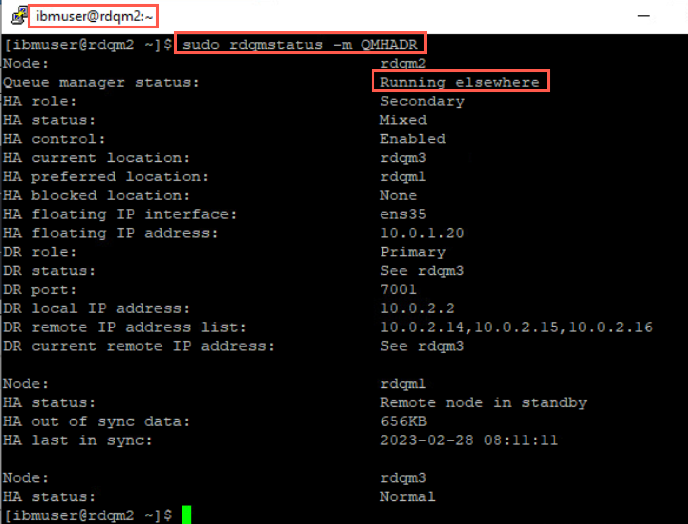
	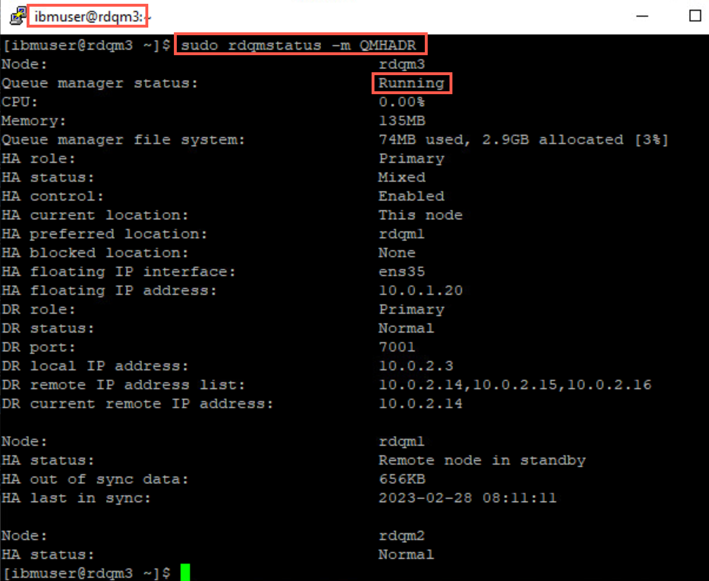
	
1. Return to **rdqm1**, issue the command to resume the replicated data node in the cluster. 

	```
	sudo rdqmadm -n rdqm1 -r
	```
	
	Quickly run the status command again. QMHADR will initially run in a secondary role on this node. If you aren't quick enough, you may not catch this transitory state.  
	
	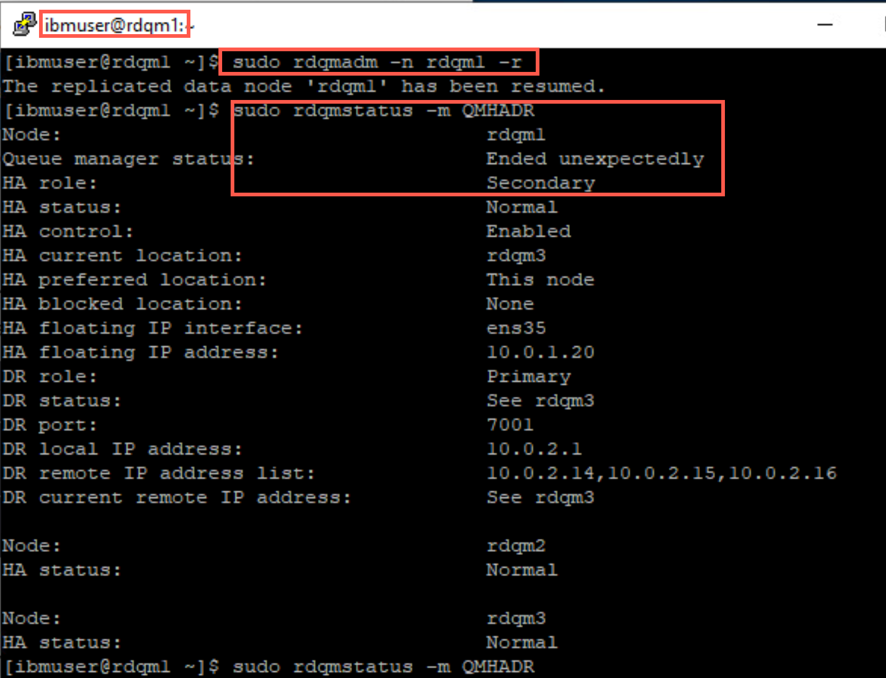
	
1. After the node has fully resumed, QMHADR will run in a primary role on this node, as it was prior to being suspending. Issue the status command again to confirm that this has indeed happened.

	```
	sudo rdqmstatus -m QMHAHR
	```
	
	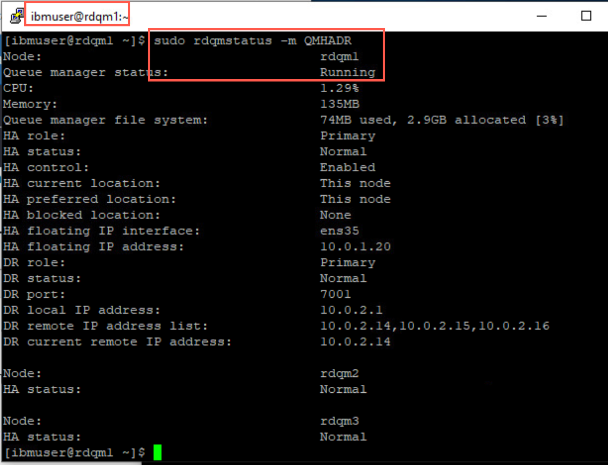

#### Failing over the RDQM to another HA remote cluster

1. To test the disaster recovery features of QMHADR, stop the queue manager on Main site node **rdqm1**.

	```
	endmqm QMHADR
	```
	
1. Run the following command on Main **rdqm1** to make QMHADR the DR secondary instance:

	```
	sudo rdqmdr -m QMHADR -s
	```
	
	Queue manager *QMHADR* has been made the DR secondary on this node.
	
1. Display the status of QMHADR on **rdqm1**.
	
	```
	sudo rdqmstatus -m QMHADR
	```
	
	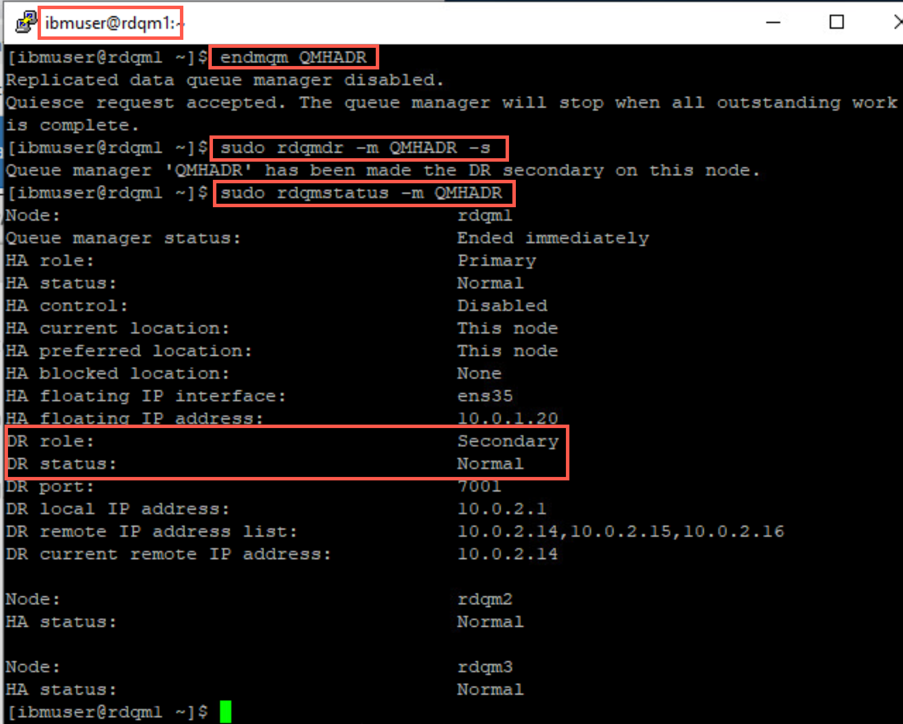
	
	Notice that the queue manager has ended and its *DRRole is Secondary*.  Although its HARole is still Primary.
	
1. Run the following command on DR site node **dr1** to make QMHADR the DR primary instance on that node:

	```
	sudo rdqmdr -m QMHADR -p
	```
	
	Queue manager *QMHADR* has been made the DR primary on this node.
	
	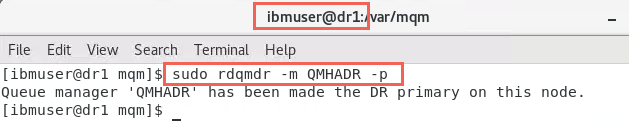
	
1. Start the queue manager on **dr1**.

	```
	strmqm QMHADR
	```
	
1. Display the status of RDQM QMHADR on DR site node **dr1**. Note that **dr1** is now the HA and DR Primary.

	```
	sudo rdqmstatus -m QMHADR
	```
	
	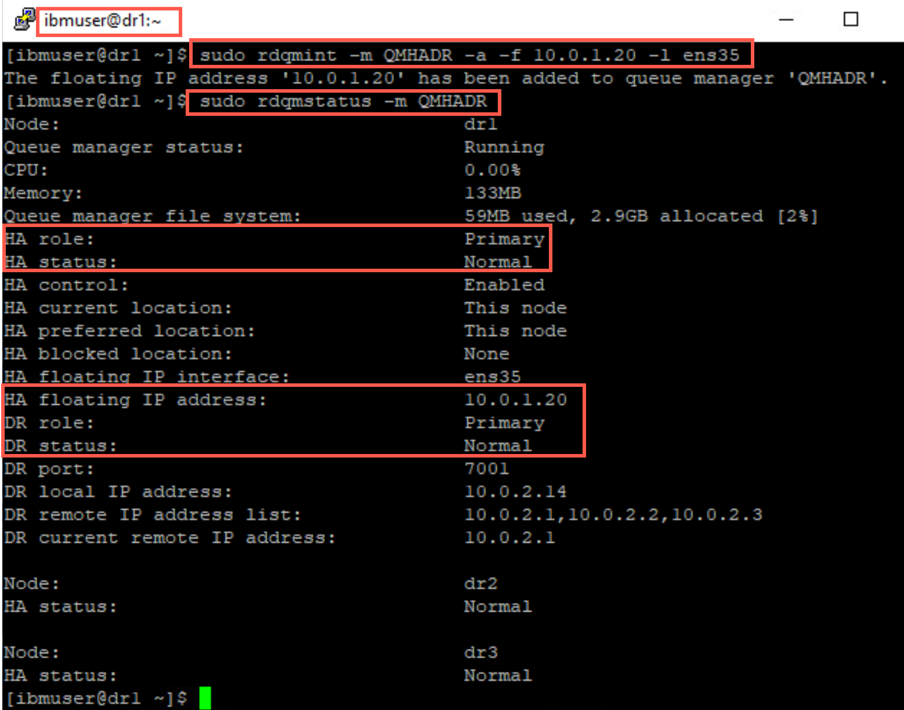
	
#### 	Move the RDQM by suspending a node on the DR HA cluster

Now you can test the HA functionality on the DR site HA cluster. Move a RDQM by suspending the node on which it is running.

1. On the node where QMHADR is running (**dr1**), return to ibmuser's terminal window. As the user **ibmuser**, issue the command to suspend the queue manager:
	
	```
	sudo rdqmadm –s -n dr1
	```
	
1. Check the status of the RDQM with the following command:

	```
	sudo rdqmstatus -m QMHADR
	```

	As shown in the display, the replicated data node is suspended and goes into standby.

	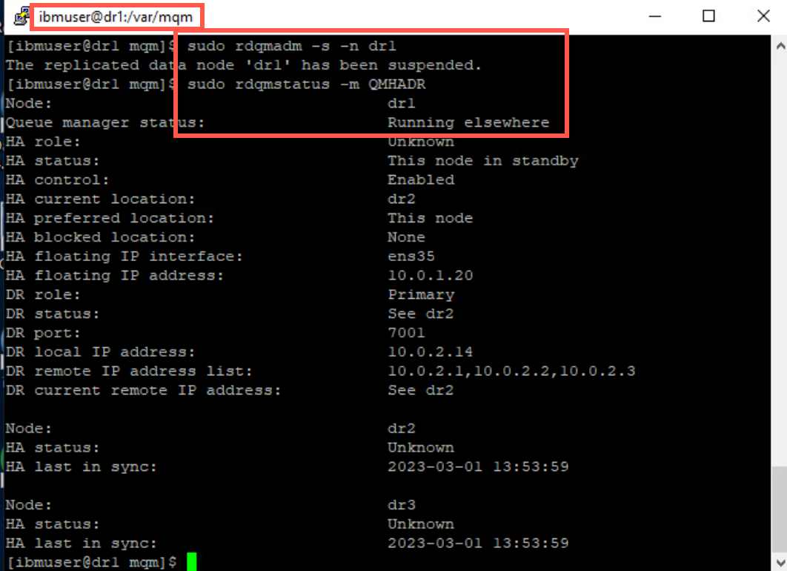
	
1. Switch to DR site nodes **dr2** and **dr3** and issue the command to display the status of QMHADR and you see that it is now running on dr2.

	```
	sudo rdqmstatus -m QMHADR
	```
	
	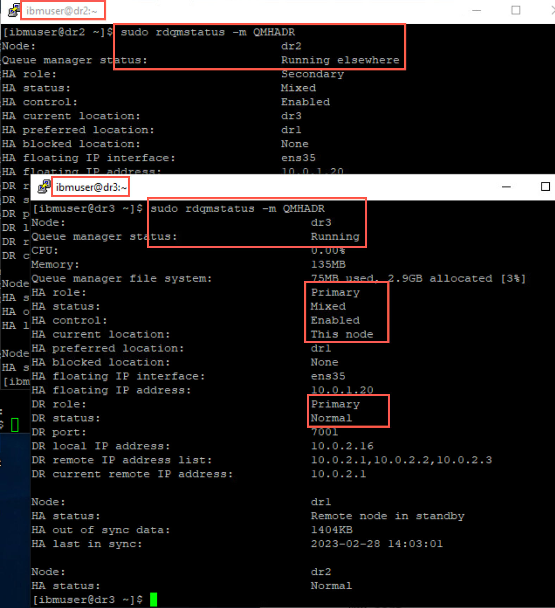
	
1. Return to **dr1**, issue the command to resume the replicated data node in the cluster. 

	```
	sudo rdqmadm -r -n dr1
	```
	
	Quickly run the status command again. QMHADR will initially run in a secondary role on this node. If you aren't quick enough, you may not catch this transitory state.  
	
	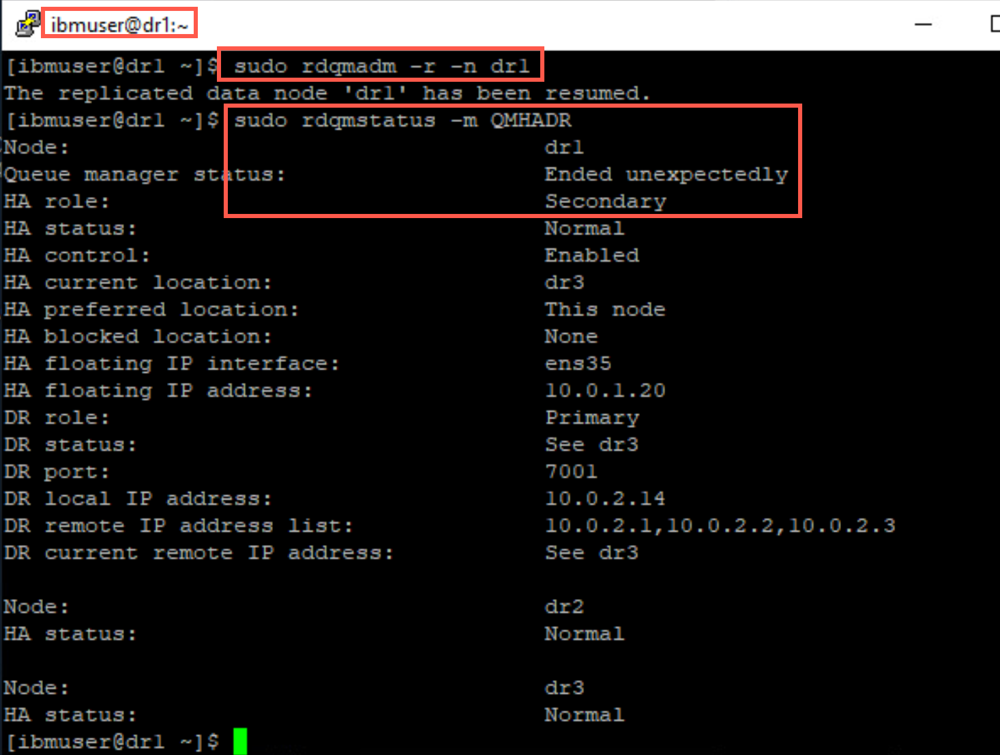
	
1. After the node has fully resumed, QMHADR will run in a primary role on this node, as it was prior to being suspending. Issue the status command again to confirm that this has indeed happened.

	```
	sudo rdqmstatus -m QMHAHR
	```
	
	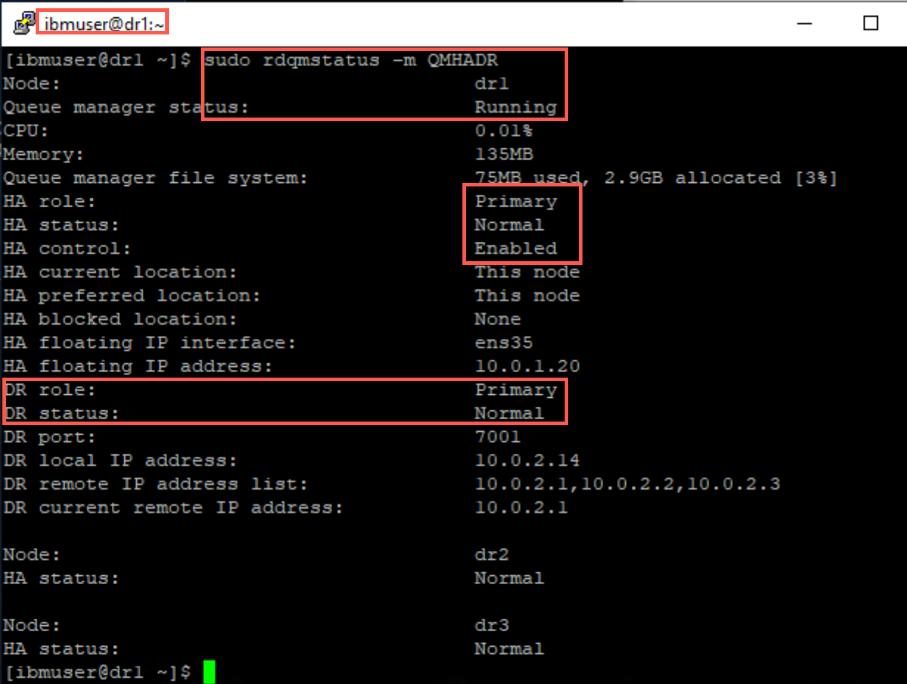

#### Move RDQM QMHADR to Main site HA cluster

1. Stop the queue manager on DR site node **dr1**.

	```
	endmqm QMHADR
	```
	
1. Make DR site DR secondary.

	```
	sudo rdqmdr -m QMHADR -s
	```
	
	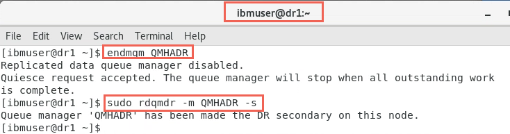

1. Switch to Main site node **rdqm1**. Make Main site DR Primary.

	```
	sudo rdqmdr -m QMHADR -p
	```
	
1. Start the queue manager on Main site node **rdqm1**.

	```
	strmqm QMHADR
	```
	
	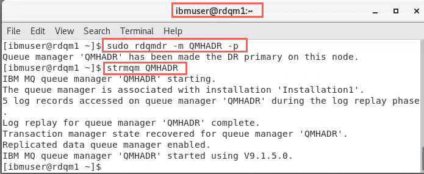
	
## Testing DR / HA with sample programs

Some High Availability sample programs are provided with MQ, which are a good visible demonstration for testing failovers. You will use these for testing:

* **amqsphac** - puts a sequence of messages to a queue with a two second delay between each message and displays events sent to its event handler. This will run on **rdqm3**.
* **amqsmhac** - copies messages from one queue to another with a default wait interval of 15 minutes after the last message that is received before the program finishes. This will run on **rdqm2**.
* **amqsghac** - gets messages from a queue and displays events sent to its event handler. This will run on **rdqm1**.
	
### Start the HA sample programs

The easiest way to configure access to the queue manager from the sample programs is to use the MQSERVER environment variable. Again, as there are 3 possible nodes where our queue manager could run, each needs to be specified, along with the listener port for the queue manager.  Now that you have a floating IP address associated with QMHADR, you can change the MQSERVER environment variable to CHANNEL1/TCP/10.0.1.0(1420).

1. On **rdqm1**, open a new terminal window and enter:
	
	```
	export MQSERVER='CHANNEL1/TCP/10.0.1.20(1420)'
	```
	
1. Change to the **/opt/mqm/samp/bin** directory, and run the command: **amqsghac TARGET QMHADR**
	
	```
	cd /opt/mqm/samp/bin
	./amqsghac TARGET QMHADR
	```

	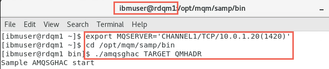
	
	Later, this will display the messages generated by amqsphac on rdqm3.

	**Leave this command to run!**
	
1. Now switch to **rdqm2**. Open a new terminal window and enter:
	
	```
	export MQSERVER='CHANNEL1/TCP/10.0.1.20(1420)'
	```
	
1. Change directory to **/opt/mqm/samp/bin** and run the command: **amqsmhac -s SOURCE -t TARGET -m QMHADR**

	```
	cd /opt/mqm/samp/bin
	./amqsmhac -s SOURCE -t TARGET –m QMHADR
	```	
	
	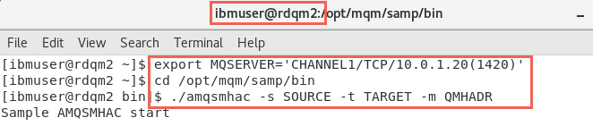
	
	**Leave this command to run!**
	
	**NOTE:** While creating this lab it was noticed that copying commands from the PDF lab guide or the online lab guide sometimes added an extra dash to the hyphen before the parameters in the command. This causes thee command to fail. If this occurs, delete the hyphen and retype it then rerun the command.

1. Now switch to **rdqm3**. As before open a new terminal window. As the user ibmuser enter:

	```
	export MQSERVER='CHANNEL1/TCP/10.0.1.20(1420)'
	```
	
1.	Change directory to **/opt/mqm/samp/bin** and run the command: **amqsphac SOURCE QMHADR**

	```
	cd /opt/mqm/samp/bin
	./amqsphac SOURCE QMHADR
	```	
	
	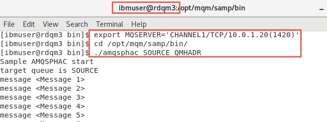
	
	**Leave this command to run!**

1. Confirm that these messages are also being displayed on **rdqm1**.

	
	
**Note:** At this stage, the queue manager is running on the primary HA node (rdqm1) and has DR Role Primary and each sample program is able to communicate with it, using the floating IP address in the MQSERVER environment variable:

CHANNEL1/TCP/**10.0.1.20(1420)**

### Move the RDQM within local HA cluster

You will now use the approach of controlling where the RDQM runs by suspending HA on node **rdqm1**. 

1. Still on **rdqm1**. In a new terminal window, run the following command as ibmuser:

	```
	sudo rdqmadm -n rdqm1 -s
	```
	
	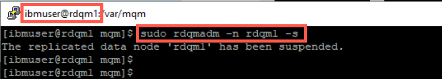
	
	**NOTE:** You suspended HA on rdqm1. Since you did not specify the preferred node Pacemaker can move the queue manager to either standby node. Check both rdqm2 and rdqm3 to see which node QMHADR is running on. In either case the applications will reconnect.
	
1. Check if the queue manager is running on **rdqm2**, by issuing command:

	```
	sudo rdqmstatus –m QMHADR
	```
	
	The output from the amqsmhac command, running in another window, should now be like this: 
	
	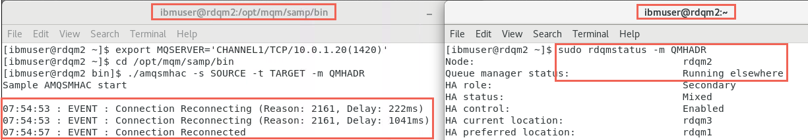
	
1. Now switch to **rdqm3**. In a terminal window, check to see if QMHADR is running here.

	The output from the amqsphac command, running on rdqm3, should similarly show messages continuing to be sent without loss after reconnecting:
	
	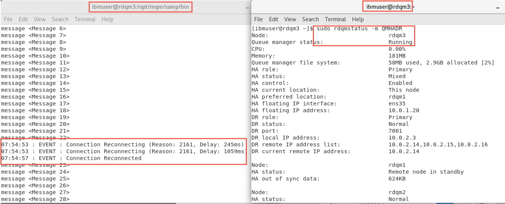


1. Now switch to **rdqm1**.

	Messages should continue to be received without loss, by amqsghac, after it connects with the queue manager at the new location:

	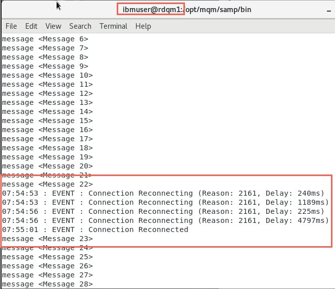
	
	
	**Note:** Now the queue manager is running on rdqm2 or rdqm3, but each sample program is still able to communicate with it by using the floating IP address specified in the MQSERVER environment variable:
	
	CHANNEL1/TCP/**10.0.1.20(1420)**
	
1. Still on **rdqm1** resume HA on this node with command:

	```
	sudo rdqmadm -n rdqm1 -r
	```
	
	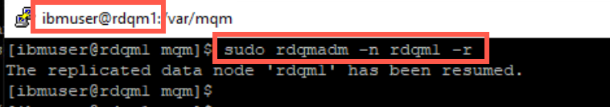
	
1. Ensure that QMHADR is now running on **rdqm1**.

	```
	sudo rdqmstatus -m QMHADR
	```	

	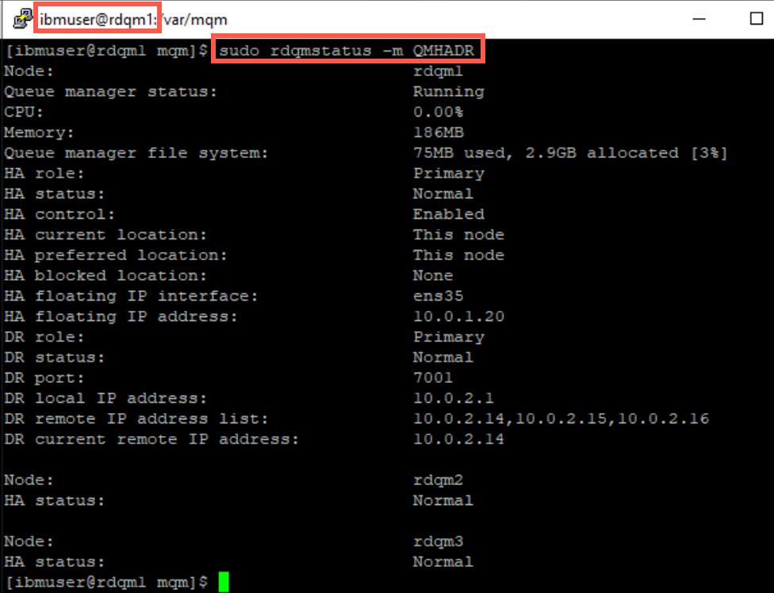
	
1. Leave the sample programs running.
	
### Move the RDQM to DR - HA cluster

The floating address 10.0.1.20 is using virtual adapter ens35, where currently you also have a fixed IP address configured on each virtual machine. You will disable ens35 on each node in the local main HA cluster to simulate a failover to the DR HA cluster.

Since the RDQM QMHADR is currently running on **rdqm1**, you will start by disabling the adapter on the standby nodes, so the RDQM cannot failover to them and must failover to the remote HA cluster.

Although the node has not been lost, you will simulate it by disabling the DR Replication Network adapter and deleting the queue manager. 
	
1. On node **rdqm3**, display the status of the ethernet adapters with the following command: 

	```
	nmcli device status
	```

	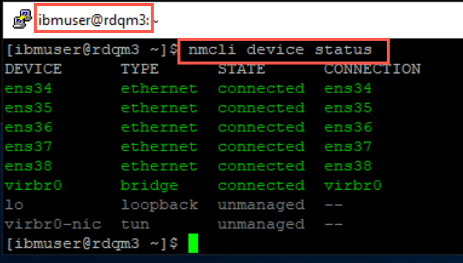

1. **ens35** network adapter is the DR Replication adapter (IP address 10.0.2.14). Turn off the network adapter with the following command:

	```
	sudo nmcli con down ens35
	```
	
	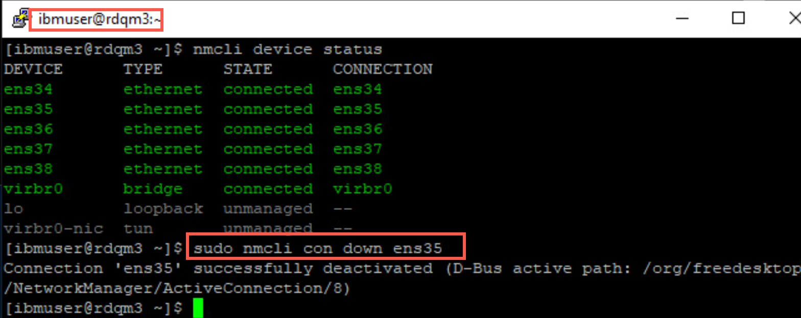
	
1. Verify that the adapter has stopped with following command:

	```
	nmcli device status
	```
	
	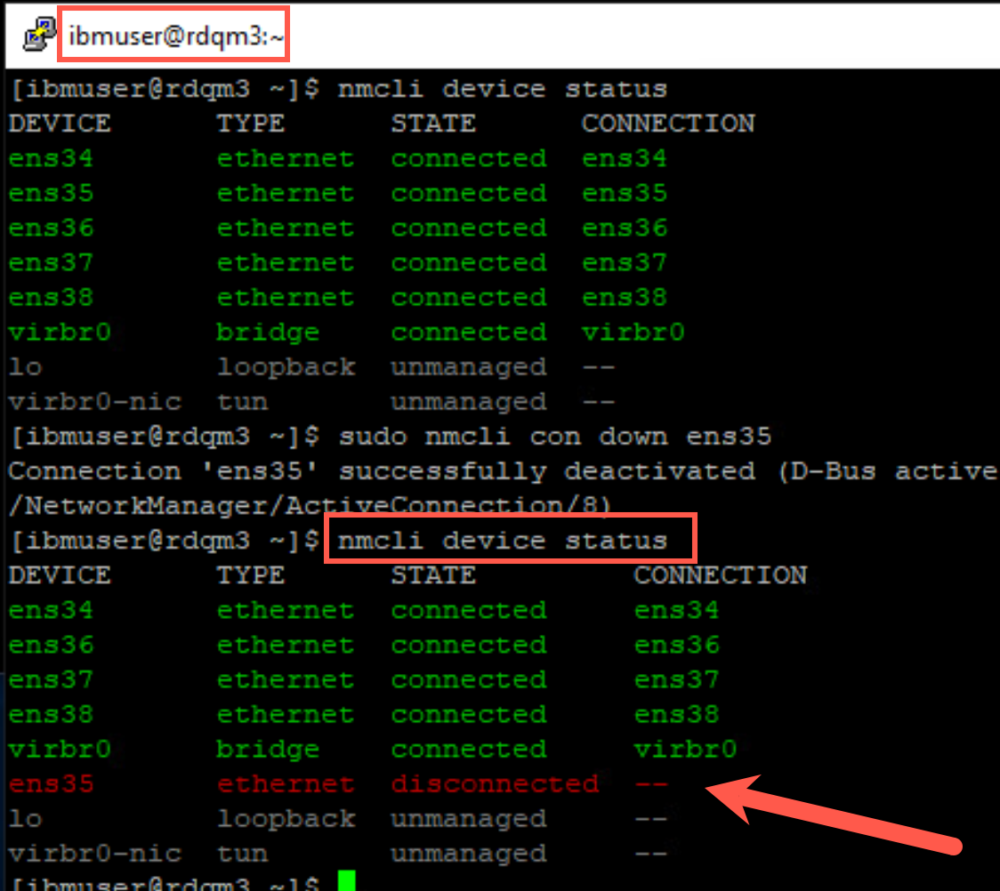
	
1. Turn off the adapter *ens35* on **rdqm2** just as you did on **rdqm3**. 

1. Using the same procedure, finally turn off the adapter *ens35* **rdqm1** to cause a DR situation. 
	
1. Switch to **dr1**. Make this node the primary node with the following command.

	```
	sudo rdqmdr -m QMHADR -p
	```

1.	Start the RDQM:
	
	```
	strmqm QMHADR
	```

1.  Display the status of QMHADR.

	```
	sudo rdqmstatus -m QMHADR
	```
	
	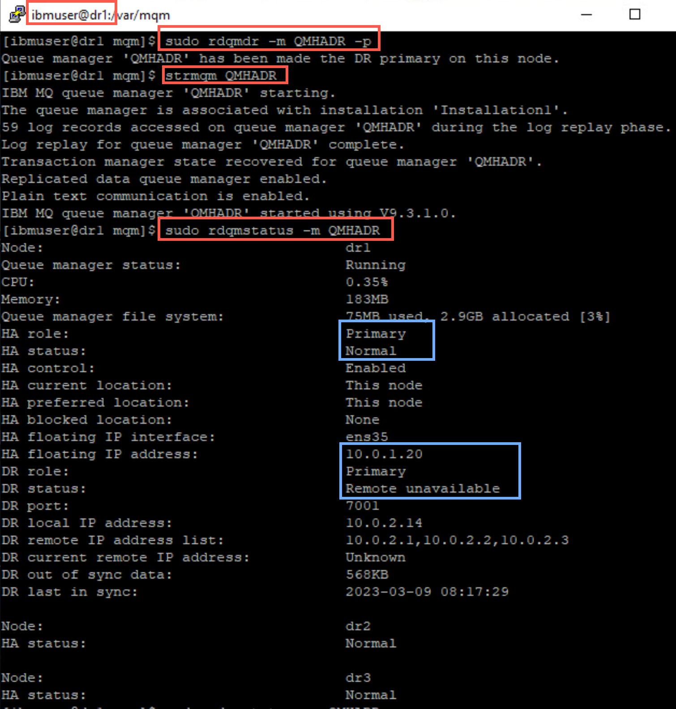
	
	You see the queue manager is now running on dr1 in the DR HA cluster. This node is primary for both HA and DR. Notice the floating IP is also listed.
	
1. In our simulation, you will need to re-enable the network adapters. Return to the nodes in the main HA cluster. Start with **rdqm1**. Turn the network adapter for *ens35* back on with the following command:

	```
	sudo nmcli con up ens35
	``` 

	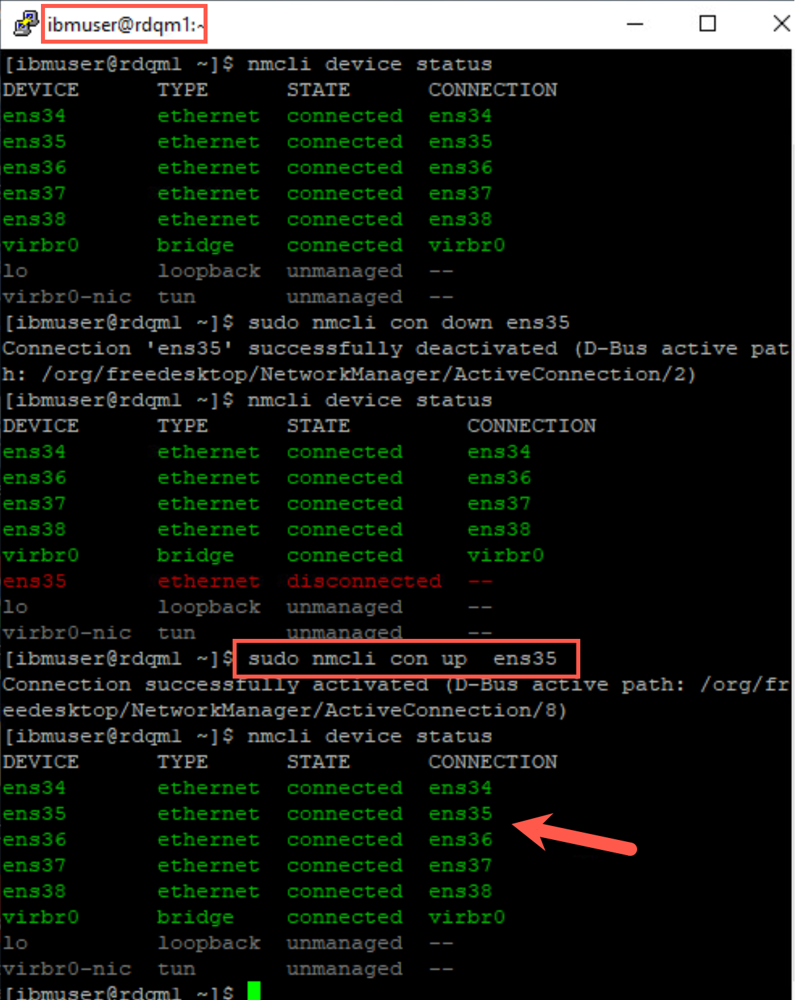
	
	Repeat this on **rdqm2** and **rdqm3**, re-enabling the *ens35* network adapter on those nodes.

1. You know that QMHADR has failed over to the DR HA cluster. So check that the *amqsphac* client to make sure it has reconnected and continues to send messages. 

	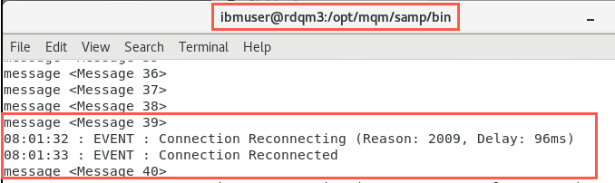
	
1. Similarly check **rdqm2** to see that *amqsmhac* client has reconnected and is forwarding messages. 

	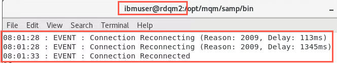
	
1. And lastly check on **rdqm1** that *amqsghac* client is getting the messages.

	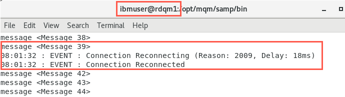
	
### Main site has recovered and the RDQM can be moved back

1. On **dr1**, stop the queue manager. 

	```
	endmqm QMHADR
	```	
1. Now you need to ensure this site's HA cluster becomes the DR secondary. To ensure this happens, you need to make each node secondary/secondary. Switch to **dr3** and issue the rdqmdr command to make this node DR secondary.

	```
	sudo rdqmdr -m QMHADR -s
	```
	
	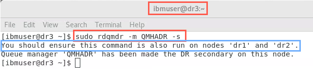
	
	The command response tells you to run the command in the other nodes within the HA cluster.		
1. Switch to **dr2** and issue the rdqmdr command again.

	```
	sudo rdqmdr -m QMHADR -s
	```
	
	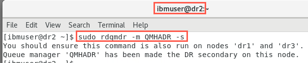
	
1. And now make **dr1** secondary DR.
	
	```
	sudo rdqmdr -m QMHADR -s
	```
	
	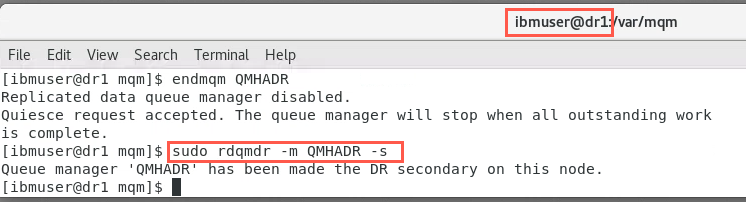

1. Once all of the adapters have been turned back on and when **dr1** became secondary, **rdqm1** automatically becomes primary again and the queue manager starts back up on **rdqm1**. Run the status commmand on **rdqm1**.

	```
	sudo rdqmstatus -m QMHADR
	```
	
1. Switch to **rdqm3**. Make sure the test application has reconnected and is sending messages.

1. Switch to **rdmq2** and check for reconnection of the test application. Then switch to **rdqm3** and make sure the test application is receiving messages.
			
1. When completed testing, stop (with ctrl-C) the HA sample programs that are currently running on each of the nodes.
	
## CONGRATULATIONS! 
### You have completed this hands-on lab.
You have created replicated data queue managers to provide high availability for IBM MQ, and tested failing over. 

## Continue to experiment with RDQM HA and DR

If you have additional time continue to experiment. You now know the commands for HA and DR. You know how to move the RDQM and cause it to failover to another node within the HA cluster and how to cause a DR scenario.

Try using the secondary HA cluster as the main and failover to the original main HA cluster. 
Use your imagination.
